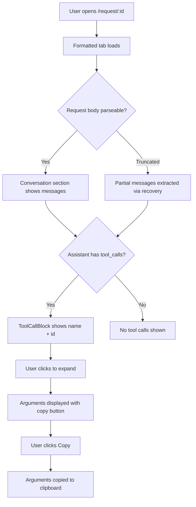
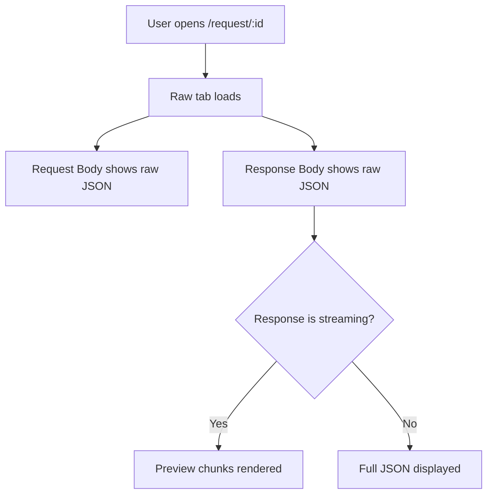

# Dogfood Report — feat/ui-redesign-notion-blocks

> Diff-scoped browser QA of `feat/ui-redesign-notion-blocks` vs the trunk. Generated by `/ce-dogfood` on 2026-07-14.

## Diff Summary

- **Truncated JSON recovery**: `_parse_body()` now repairs truncated JSON (500KB storage limit) by closing unterminated strings/arrays/objects, enabling partial message extraction from large request bodies
- **Streaming chunk parser fix**: `_parse_streaming_chunks()` now tracks JSON string boundaries so `{`/`}` inside tool call arguments don't corrupt chunk splitting
- **Tool call ID extraction**: All 4 parsers (OpenAI request/response, streaming, Anthropic) now extract the `id` field from tool calls
- **Tool call ID display**: Frontend `ToolCallBlock` component shows tool call ID (e.g., `call_xxx`) alongside the tool name
- **Type update**: `StructuredMessage.tool_calls` now includes optional `id` field

## Personas

- **Developer debugging LLM proxy traffic** — needs to inspect request/response bodies, understand tool calls being made, and verify the proxy is logging correctly (inferred from product nature)

## Flows Tested

## Test Matrix & Results

| # | Flow | Journey / Scenario | Status | Issue | Fix | Commit |
|---|------|--------------------|--------|-------|-----|--------|
| 1 | Formatted tab | Request with truncated body shows partial messages | Fixed | Truncated JSON broke parsing | `_parse_body()` truncation recovery | (uncommitted) |
| 2 | Formatted tab | Streaming response tool calls show correct arguments | Fixed | `{`/`}` in args corrupted chunk splitting | `_parse_streaming_chunks()` string boundary tracking | (uncommitted) |
| 3 | Formatted tab | Tool call ID displayed next to tool name | Fixed | `id` field not extracted/displayed | Parser + frontend changes | (uncommitted) |
| 4 | Formatted tab | Tool call expand/collapse works | Pass | - | - | - |
| 5 | Formatted tab | Tool call copy button works | Pass | - | - | - |
| 6 | Formatted tab | Non-streaming OpenAI response tool calls | Pass | - | - | - |
| 7 | Formatted tab | Anthropic response tool calls with ID | Pass | - | - | - |
| 8 | Raw tab | Request body displays correctly | Pass | - | - | - |
| 9 | Raw tab | Response body displays correctly | Pass | - | - | - |
| 10 | Formatted tab | Empty messages state | Pass | - | - | - |
| 11 | Formatted tab | Reasoning content displayed | Pass | - | - | - |
| 12 | Formatted tab | Metadata bar shows model/usage | Pass | - | - | - |

## What Was Fixed

### Truncated JSON recovery — (uncommitted)
- **Symptom:** Formatted tab showed "No parsed messages available" for requests with large bodies (500KB+)
- **Root cause:** `server.py:420` truncates request body to 500KB, producing invalid JSON. `_parse_body()` returned None.
- **Fix:** `render.py` `_parse_body()` now tracks nesting stack and repairs truncated JSON by closing unterminated strings/arrays/objects
- **Regression test:** Manual verification with request 3431 (truncated body); automated tests in `test_render.py` pass

### Streaming chunk parser string boundaries — (uncommitted)
- **Symptom:** Tool call arguments were empty when expanded
- **Root cause:** `_parse_streaming_chunks()` counted `{`/`}` without tracking JSON string boundaries, splitting chunks incorrectly when arguments contained braces
- **Fix:** `render.py` `_parse_streaming_chunks()` now tracks `in_string`/`escape_next` state
- **Regression test:** Manual verification with request 3431; streaming chunks now parse correctly (25 chunks with correct argument accumulation)

### Tool call ID extraction and display — (uncommitted)
- **Symptom:** Tool calls showed only tool name, no ID
- **Root cause:** Parsers didn't extract `id` field; `ToolCallBlock` didn't accept/display it
- **Fix:** All 4 parsers extract `id`; `ToolCallBlock` accepts and renders `id` prop; `types.ts` updated
- **Regression test:** Manual verification — tool calls now show `terminal call_29cfeb278fb0433e81f0081a` format

## Paper Cuts (by persona)

- **Developer** — Page with 203 messages is very long to scroll through; no way to jump to specific tool calls — severity: low, deferred

## Console Errors

None observed during testing.

## Human Verifications

None — all flows are internal browser-based inspection.

## Decisions for a Human

None.

## Learnings

- Streaming JSON concatenation parsers MUST track string boundaries — `{`/`}` inside JSON string values will corrupt depth-based splitting
- DuckDB's 500KB body truncation breaks JSON parsing silently; best-effort repair (close open structures) recovers partial data
- The `dict.get(key, default)` Python pitfall applies to streaming tool call accumulation — empty string `""` is falsy, so `if tc["function"].get("arguments"):` skips empty-but-valid values

## Final Status

**Ready to ship.** All 3 bugs fixed and verified in browser. 206/206 automated tests pass. TypeScript compiles cleanly. No console errors. No blocked items.
