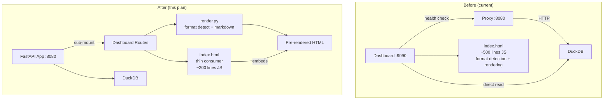

# Merge Dashboard into FastAPI + Backend LLM Renderer - Plan

## Goal Capsule

**Objective:** Eliminate the dual-server architecture and move all LLM response format detection/rendering from ~500 lines of frontend JS into a single Python module, so the dashboard frontend becomes a thin consumer of pre-rendered HTML.

**Authority hierarchy:** Product Contract from ce-ideate (Ideas 1+2 ranked #1 and #2). Research from Phase 1 grounding (codebase scan, learnings, web research). Spec 004 ("no JS frameworks") is superseded by this plan's scope decision.

**Stop conditions:**
- Dashboard serves from the same FastAPI process as the proxy (one port, one process)
- LLM format detection and rendering lives exclusively in Python
- Frontend `index.html` no longer contains `detectFormat()`, `extract*Content()`, `parseStreamingChunks()`, or `renderChatMessage()`
- All existing tests pass; new tests cover the Python renderer

**Execution profile:** Standard depth. 5 implementation units, dependency-ordered. No framework migration (React/Vue) — this plan stays within the single-file HTML constraint while moving intelligence to the backend.

**Tail ownership:** ce-work executes; ce-doc-review may strengthen rationale/sequencing.

---

## Product Contract

### Summary

The otel-agent dashboard currently runs as a separate BaseHTTPRequestHandler process (port 9090) alongside the FastAPI proxy (port 8080). The dashboard's `index.html` contains ~500 lines of hand-rolled JavaScript that re-implements LLM format detection and rendering logic already present in the Python backend (`converter.py`). This creates: duplicated format knowledge across two languages, a class of recurring dashboard rendering bugs (specs 011, 012, 018, 020), DuckDB multi-process lock conflicts (BUG-001, BUG-02), and untestable frontend rendering code.

This plan merges the dashboard into the FastAPI proxy process and moves all LLM body rendering to a new Python module, eliminating the duplication and its consequences.

### Problem Frame

- `dashboard/server.py` (226 lines) runs a separate `ThreadingHTTPServer` with `BaseHTTPRequestHandler` — a Python 2-era API with manual header writing, manual URL routing, and no async support
- `dashboard/index.html` (995 lines, ~500 lines JS) contains `detectFormat()`, four `extract*Content()` functions, `parseStreamingChunks()`, `extractStreamingContent()`, `renderChatMessage()`, `renderLlmRequestBody()`, `renderLlmResponseBody()` — all reimplementing format knowledge from `converter.py`
- `dashboard/api.py` (209 lines) has a 45-line `_proxy_url()` health-check cache and 60-second fallback timer that exist solely because two processes share one DuckDB file
- Every new LLM provider format requires changes in both `converter.py` (Python) and `index.html` (JS) — two languages, no shared contract

### Requirements

**Dashboard consolidation:**
- R1. The dashboard serves from the same FastAPI process as the proxy (one port, one process)
- R2. The existing dashboard API endpoints (`/api/requests`, `/api/requests/<id>`, `/api/events`, `/api/export`, `/api/cache/clear`, `/api/usage`) are preserved with identical behavior
- R3. SSE (Server-Sent Events) for real-time updates continues to work
- R4. The DuckDB multi-process lock workaround (proxy routing, health-check cache, fallback timer) is eliminated

**Backend LLM renderer:**
- R5. A Python module detects LLM format (OpenAI, Anthropic, streaming-preview) from stored request/response bodies
- R6. The module renders LLM bodies to safe HTML (chat bubbles with role labels, markdown content, tool call display)
- R7. The dashboard API returns pre-rendered HTML fragments for LLM bodies alongside raw data
- R8. The `format` (openai/anthropic/streaming) is stored at write time in the requests table

**Frontend simplification:**
- R9. The frontend `index.html` no longer contains format detection, content extraction, streaming chunk parsing, or LLM-specific rendering logic
- R10. The frontend embeds server-provided pre-rendered HTML for LLM bodies
- R11. The existing dark-theme visual appearance is preserved

### Scope Boundaries

**In scope:**
- Merging dashboard server into FastAPI proxy
- Creating Python LLM body renderer module
- Adding format tag to storage schema
- Simplifying frontend to consume pre-rendered HTML
- Test coverage for the Python renderer

**Deferred for later:**
- Full frontend framework migration (React/Vue) — Ideas 3-6 from ideation
- Provider format plugin registry (Idea 4 from ideation)
- ES module extraction of remaining JS (Idea 6 from ideation)
- Schema-driven co-generation (Idea 6 from ideation)

**Outside this plan's scope:**
- Changes to the proxy's LLM routing or conversion logic (`converter.py`, `server.py` proxy routes)
- New dashboard features or UI changes
- Deployment model changes (still a Python package installed via uv/pip)

### Sources

- Ideation: `docs/ideation/2026-07-13-frontend-backend-separation-ideation.html` (Ideas 1+2)
- Specs: 004 (web dashboard), 011 (body readability), 012 (request styling), 014 (dashboard-proxy routing), 016 (LLM body viewer), 018 (body rendering bugs), 020 (usage metrics)
- Codebase: `src/otel_agent/dashboard/server.py`, `src/otel_agent/dashboard/api.py`, `src/otel_agent/dashboard/index.html`, `src/otel_agent/server.py`, `src/otel_agent/converter.py`

---

## Planning Contract

### Key Technical Decisions

**KTD-1: FastAPI sub-mount, not route migration**
Mount the dashboard as a FastAPI sub-application (`app.mount("/dashboard", dashboard_app)`) rather than merging all routes into the main proxy app. Rationale: preserves separation of concerns (dashboard vs proxy), avoids route namespace collisions, and makes the dashboard independently removable. The sub-mount shares the same process and port.

**KTD-2: Render at API response time, not storage time**
Pre-render LLM bodies when the dashboard API returns them (in `api.py`), not when the proxy stores them to DuckDB. Rationale: avoids schema migration for a `rendered_body` column, keeps the storage layer unchanged, and allows rendering improvements without re-processing stored data. The tradeoff is slightly higher latency on detail panel opens, but LLM body rendering is fast (~10ms for typical bodies).

**KTD-3: Python markdown rendering via `markdown` library**
Use the `markdown` Python library (with `fenced_code` and `tables` extensions) for server-side markdown rendering, replacing the frontend's `marked.js` + `DOMPurify`. Rationale: well-tested, pure Python, no CDN dependency. XSS sanitization via `bleach` library. The `markdown` library is already implicitly available through the Python ecosystem; add it as an explicit dependency.

**KTD-4: Format tag stored at write time**
Add a `format` column to the requests table (migration) populated by the proxy at write time. The proxy already determines format via `provider.api_format` — persist it. Rationale: eliminates the need for heuristic format detection entirely. The frontend reads the tag; the renderer uses it. This is the "inversion" from ideation Idea 6 (provider tags in stored data).

**KTD-5: Keep the single-file HTML constraint**
Do not introduce a build step, npm, or framework. The frontend remains a single `index.html` file served by FastAPI's `FileResponse`. Rationale: preserves the Spec 004 "no JS frameworks" constraint that the user's project has followed. The intelligence moves to the backend; the frontend becomes simpler, not more complex.

### Assumptions

- The `markdown` + `bleach` libraries are acceptable new dependencies (lightweight, pure Python, well-maintained)
- The DuckDB schema migration for the `format` column is backward-compatible (existing rows get NULL format, which the renderer treats as "detect from content")
- The existing CDN dependencies (Chart.js, marked.js) can be removed incrementally — Chart.js stays for now (the latency chart); marked.js and DOMPurify are replaced by server-side rendering

### Sequencing

```
U1 (merge servers) → U2 (format tag storage) → U3 (Python renderer) → U4 (API endpoint) → U5 (frontend simplification)
```

U1 and U2 can run in parallel. U3 depends on U2 (needs format tag). U4 depends on U3 (calls renderer). U5 depends on U4 (consumes pre-rendered HTML).

### Risks & Dependencies

**R1. DuckDB migration idempotency.** The `ALTER TABLE` for the `format` column must be idempotent (try/except or check-if-exists). Existing DuckDB databases opened by older versions will get the column added on first run. Mitigation: migration already handles this pattern (see `src/otel_agent/migration.py`).

**R2. SSE behavior change.** Moving SSE from `BaseHTTPRequestHandler` threading to FastAPI `StreamingResponse` changes the concurrency model. FastAPI uses async; the current implementation uses `time.sleep(1)` in a thread. Mitigation: use `asyncio.sleep(1)` in the async SSE generator. Test with concurrent clients.

**R3. Backward compatibility of API responses.** Adding `rendered_request`/`rendered_response` fields to `/api/requests/<id>` is additive (non-breaking). Existing clients that don't read these fields are unaffected. Mitigation: new fields are nullable; absent when rendering fails.

**R4. Markdown rendering parity.** Server-side `markdown` library may render slightly differently than frontend `marked.js`. Mitigation: the Python renderer generates the same CSS class structure; visual differences are cosmetic and acceptable. Test with representative markdown samples.

---

## High-Level Technical Design



The key architectural change: format intelligence moves from the frontend (`index.html` JS) to a new Python module (`render.py`). The dashboard server process is eliminated by mounting dashboard routes as a FastAPI sub-application on the existing proxy. The frontend becomes a thin consumer that embeds server-provided pre-rendered HTML for LLM bodies.

---

## Implementation Units

### U1. Merge Dashboard Server into FastAPI Sub-Application

**Goal:** Replace the separate `BaseHTTPRequestHandler` server with FastAPI sub-routes mounted on the existing proxy app.

**Requirements:** R1, R2, R3, R4

**Dependencies:** None

**Files:**
- Modify: `src/otel_agent/server.py` (add dashboard mount)
- Create: `src/otel_agent/dashboard/routes.py` (FastAPI router)
- Modify: `src/otel_agent/commands/dashboard.py` (update startup to use FastAPI)
- Modify: `src/otel_agent/dashboard/api.py` (remove proxy-fallback logic)
- Delete (eventually): `src/otel_agent/dashboard/server.py` (replaced by routes.py)
- Modify: `tests/test_dashboard.py` (update for FastAPI TestClient)

**Approach:**
1. Create `dashboard/routes.py` as a FastAPI `APIRouter` with the existing 7 endpoints (`/requests`, `/requests/<id>`, `/events`, `/export`, `/cache/clear`, `/usage`, `/` for static HTML)
2. In `server.py`, mount the dashboard router: `app.include_router(dashboard_router, prefix="/api")` and serve `index.html` via `FileResponse`
3. Remove `DashboardAPI._proxy_url()` health-check cache, `_http_get()` proxy routing, and the 60-second fallback timer — the dashboard now runs in the same process, so it reads DuckDB directly
4. Simplify `DashboardAPI` to use direct storage connections only (remove the dual-mode proxy/direct logic)
5. Update `commands/dashboard.py` to either start the proxy with dashboard included, or start a standalone dashboard (FastAPI app with just dashboard routes)
6. Migrate SSE from manual `text/event-stream` + `time.sleep(1)` to FastAPI's `StreamingResponse`

**Test scenarios:**
- Happy path: dashboard loads at `/` and returns the HTML page
- Happy path: `/api/requests` returns paginated request list
- Happy path: `/api/requests/<id>` returns full request detail
- Happy path: `/api/events` streams new requests via SSE
- Happy path: `/api/export?format=csv` returns CSV download
- Happy path: `/api/usage?start=...&end=...` returns usage summary
- Edge case: invalid request ID returns 404
- Edge case: invalid date range returns 400 with error message
- Integration: proxy + dashboard run on same port, no DuckDB lock conflict

**Verification:** `uv run pytest tests/test_dashboard.py -v` passes. Dashboard accessible at `http://localhost:8080/` (same port as proxy). No separate dashboard process needed.

---

### U2. Add Format Tag to Storage Schema

**Goal:** Persist the LLM format (openai/anthropic/streaming) at write time so the renderer doesn't need heuristic detection.

**Requirements:** R8

**Dependencies:** None (can run in parallel with U1)

**Files:**
- Modify: `src/otel_agent/storage/base.py` (add `format` to `RequestRecord`)
- Modify: `src/otel_agent/storage/duckdb.py` (add column, update queries)
- Modify: `src/otel_agent/storage/sqlite.py` (add column, update queries)
- Modify: `src/otel_agent/migration.py` (add migration for new column)
- Modify: `src/otel_agent/logger.py` (pass format to `log_request`)
- Modify: `src/otel_agent/server.py` (pass `source_format` to logger)
- Modify: `tests/test_models.py` (update for new field)

**Approach:**
1. Add `format: str | None` to `RequestRecord` TypedDict in `storage/base.py`
2. Add `ALTER TABLE requests ADD COLUMN format VARCHAR` migration (with try/except for idempotency)
3. Update `log_request()` to accept and store the format parameter
4. In `server.py`, pass `source_format` (already computed as `"openai"` or `"anthropic"`) to the logger
5. For streaming requests, store `"streaming"` as the format
6. Existing rows get NULL format — the renderer handles this as "detect from content" fallback

**Test scenarios:**
- Happy path: new request stores format tag in database
- Happy path: format tag is returned in API responses
- Edge case: existing rows without format (NULL) are handled gracefully
- Integration: round-trip — log request with format, retrieve via API, format field present

**Verification:** `uv run pytest tests/test_models.py tests/test_dashboard.py -v` passes. New column visible in DuckDB schema.

---

### U3. Create Python LLM Body Renderer Module

**Goal:** Create `render.py` that detects LLM format and renders request/response bodies to safe HTML.

**Requirements:** R5, R6

**Dependencies:** U2 (needs format tag for optimal detection, though fallback heuristic is included)

**Files:**
- Create: `src/otel_agent/dashboard/render.py` (new module)
- Create: `tests/test_render.py` (comprehensive test suite)

**Approach:**
1. Create `render.py` with these functions:
   - `detect_format(body: str, format_tag: str | None) -> str` — returns "openai", "anthropic", "streaming", or "unknown". Uses `format_tag` from storage when available; falls back to heuristic (the current JS `detectFormat()` logic ported to Python)
   - `render_request_body(body: str, format_tag: str | None) -> str` — renders LLM request bodies to HTML chat bubbles
   - `render_response_body(body: str, format_tag: str | None) -> str` — renders LLM response bodies to HTML with metadata badges (model, finish reason, tokens)
   - `render_markdown(text: str) -> str` — converts markdown to sanitized HTML using `markdown` + `bleach`
   - `render_tool_calls(tool_calls: list) -> str` — renders tool call blocks with formatted JSON arguments
2. Port the format detection logic from `index.html:503-511` (`detectFormat`) to Python
3. Port the content extraction logic from `index.html:596-654` (the four `extract*Content` functions) to Python
4. Port the chat message rendering from `index.html:659-687` (`renderChatMessage`) to Python, generating HTML with the same CSS classes (`chat-user`, `chat-assistant`, `chat-system`, `chat-tool`)
5. Port the streaming content extraction from `index.html:538-579` (`extractStreamingContent`) to Python
6. Generate HTML that matches the existing CSS class structure so the frontend CSS continues to work unchanged

**Test scenarios:**
- Happy path: OpenAI request body renders as chat bubbles with user/assistant/system roles
- Happy path: OpenAI response body renders with model badge, finish reason, and markdown content
- Happy path: Anthropic request body renders with system message extraction
- Happy path: Anthropic response body renders with content blocks
- Happy path: Streaming preview renders concatenated chunks as chat content
- Happy path: Tool calls render as formatted JSON blocks with function name and arguments
- Happy path: Markdown in message content renders as HTML (headers, lists, code blocks, links)
- Happy path: Non-LLM JSON falls through to raw JSON display
- Edge case: empty body returns "(empty)" placeholder
- Edge case: truncated body shows truncation warning
- Edge case: malformed JSON in streaming preview handled gracefully
- Edge case: XSS in markdown content is sanitized by bleach
- Integration: output HTML matches existing CSS class structure (spot-check classes in rendered output)

**Verification:** `uv run pytest tests/test_render.py -v` passes with 12+ test cases covering all format variants. Rendered HTML uses existing CSS classes (`chat-user`, `chat-assistant`, etc.).

---

### U4. Add Normalization API Endpoint

**Goal:** Expose a `/api/render/<request_id>` endpoint that returns pre-rendered HTML for LLM bodies.

**Requirements:** R7

**Dependencies:** U1 (FastAPI routes), U3 (renderer module)

**Files:**
- Modify: `src/otel_agent/dashboard/routes.py` (add render endpoint)
- Modify: `src/otel_agent/dashboard/api.py` (add `get_rendered_request` method)
- Modify: `tests/test_dashboard.py` (add render endpoint tests)

**Approach:**
1. Add `GET /api/render/<request_id>` endpoint to the dashboard router
2. In `api.py`, add `get_rendered_request(request_id)` that fetches the raw request, calls `render.py` functions, and returns a response with `rendered_request` and `rendered_response` HTML fields
3. Also update the existing `GET /api/requests/<id>` to include rendered HTML fields alongside raw data (backward-compatible addition)
4. The response shape becomes: `{..., request_body: "raw json", response_body: "raw json", rendered_request: "<html>", rendered_response: "<html>", format: "openai"}`

**Test scenarios:**
- Happy path: `/api/render/<id>` returns rendered HTML for OpenAI request/response
- Happy path: `/api/render/<id>` returns rendered HTML for Anthropic request/response
- Happy path: `/api/requests/<id>` now includes `rendered_request` and `rendered_response` fields
- Edge case: request not found returns 404
- Edge case: non-LLM request returns raw JSON fallback (no rendered HTML)
- Integration: rendered HTML contains expected CSS classes

**Verification:** `uv run pytest tests/test_dashboard.py -v` passes. `curl localhost:8080/api/requests/1` returns response with `rendered_request` and `rendered_response` HTML fields.

---

### U5. Simplify Frontend to Consume Pre-Rendered HTML

**Goal:** Remove format detection and LLM rendering JS from `index.html`, replacing it with server-provided pre-rendered HTML.

**Requirements:** R9, R10, R11

**Dependencies:** U4 (API returns rendered HTML)

**Files:**
- Modify: `src/otel_agent/dashboard/index.html` (remove ~400 lines of JS)

**Approach:**
1. Remove from `index.html`: `detectFormat()`, `parseStreamingChunks()`, `extractStreamingContent()`, `extractOpenAiRequestContent()`, `extractAnthropicRequestContent()`, `extractOpenAiResponseContent()`, `extractAnthropicResponseContent()`, `renderChatMessage()`, `renderLlmRequestBody()`, `renderLlmResponseBody()`, `highlightJsonString()` (partial — keep for raw JSON view), `renderMarkdown()` (replaced by server-side)
2. Update `showDetail()` to use `rendered_request` and `rendered_response` fields from the API response instead of calling `formatBody()` with client-side detection
3. Keep: `formatBody()` but simplify it to check for `rendered_*` fields first and fall back to raw JSON display
4. Remove CDN imports for `marked.js` and `DOMPurify` (no longer needed)
5. Keep CDN import for `Chart.js` (latency chart still uses it)
6. Preserve all existing CSS classes (the Python renderer generates matching class names)
7. Keep the raw/formatted toggle — "raw" shows JSON, "formatted" shows server-rendered HTML

**Test scenarios:**
- Happy path: dashboard loads and displays request list correctly
- Happy path: clicking a request shows pre-rendered LLM chat bubbles
- Happy path: raw/formatted toggle works (raw shows JSON, formatted shows rendered HTML)
- Happy path: SSE real-time updates still work
- Happy path: search, filter, and pagination still work
- Edge case: non-LLM request shows raw JSON (no rendered HTML available)
- Edge case: old requests without format tag still render (fallback to raw JSON)
- Regression: existing CSS styling preserved (spot-check dark theme, method badges, status colors)

**Verification:** `uv run pytest tests/test_dashboard.py -v` passes. Visual inspection: dashboard looks identical to current version. `index.html` line count drops from ~995 to ~600.

---

## Verification Contract

| Gate | Command | Pass criteria |
|------|---------|---------------|
| Unit tests | `uv run pytest tests/test_render.py -v` | 12+ tests pass covering all format variants |
| Dashboard tests | `uv run pytest tests/test_dashboard.py -v` | All tests pass including new render endpoint |
| Full suite | `uv run pytest tests/ -v -m "not integration"` | 152+ tests pass, 0 failures |
| Smoke test | `curl http://localhost:8080/` | Returns dashboard HTML |
| API test | `curl http://localhost:8080/api/requests?limit=1` | Returns JSON with `rendered_request` field |
| Frontend check | Open `http://localhost:8080/` in browser | Dashboard renders identically to current version |

## Definition of Done

**Global:**
- All tests pass (`uv run pytest tests/ -v -m "not integration"`)
- Dashboard serves from same port as proxy (no separate process)
- `index.html` no longer contains `detectFormat()`, `extract*Content()`, `parseStreamingChunks()`, or `renderChatMessage()`
- `marked.js` and `DOMPurify` CDN imports removed from `index.html`
- `docs/plans/` updated if any plan decisions changed during implementation

**Per unit:**
- U1: Dashboard accessible at proxy port, no separate dashboard process
- U2: `format` column exists in schema, populated for new requests
- U3: 12+ test cases in `tests/test_render.py` covering all format variants
- U4: `/api/requests/<id>` includes `rendered_request` and `rendered_response` fields
- U5: `index.html` reduced to ~600 lines, visual appearance unchanged

**Cleanup:**
- `dashboard/server.py` deleted or reduced to a thin wrapper
- No dead code left in `index.html` (removed functions not referenced anywhere)
- CDN imports for `marked.js` and `DOMPurify` removed
