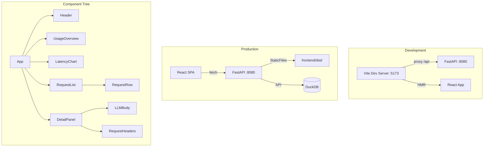

# React + Vite Dashboard Migration - Plan

## Goal Capsule

**Objective:** Migrate the otel-agent dashboard from a 684-line monolithic `index.html` to a React + Vite SPA, gaining component isolation, TypeScript safety, and a modern development experience while preserving the existing dark-theme UI and all current functionality.

**Authority hierarchy:** Idea 3 from ce-ideate (ranked #3, deferred from the first plan). The backend already renders LLM bodies via Python (`render.py`), so this migration focuses on frontend architecture — not LLM rendering.

**Stop conditions:**
- Dashboard serves from the same FastAPI process (existing `GET /` route serves the built SPA)
- All current features work: request list, detail panel, SSE, search/filter, pagination, usage stats, charts, export
- TypeScript compiles with zero errors
- All existing tests pass; new component tests added
- `npm run build` produces a production bundle served by FastAPI's `StaticFiles`
- Development mode: `npm run dev` proxies API calls to the running FastAPI server

**Execution profile:** Deep plan. 6 implementation units, dependency-ordered. Framework migration touching frontend architecture, build pipeline, and deployment model.

---

## Product Contract

### Summary

The dashboard currently serves a single `index.html` file with embedded CSS (~170 lines) and JS (~500 lines). While the backend already handles LLM format detection and rendering (via `render.py`), the frontend code is still vanilla JS with global scope, no type safety, and manual DOM manipulation. A React + Vite migration brings component isolation, hot module replacement, TypeScript, and a standard build pipeline.

### Problem Frame

- `index.html` (684 lines) mixes CSS, HTML structure, and JS in one file with no module system
- All state is global (currentCursor, chart, cursorStack) — no component boundaries
- DOM manipulation via `innerHTML` and `getElementById` — fragile, no virtual DOM diffing
- No type safety — format detection, API responses, and rendering are all untyped
- CDN dependencies (Chart.js) loaded at runtime — no offline support, no version pinning
- No build step — can't use npm packages, TypeScript, or tree-shaking

### Requirements

**Infrastructure:**
- R1. Vite + React project scaffolding under `frontend/` directory
- R2. TypeScript with strict mode
- R3. Development proxy to FastAPI backend (Vite's `server.proxy`)
- R4. Production build served by FastAPI via `StaticFiles` or `FileResponse`
- R5. `npm run build` produces optimized bundle in `frontend/dist/`

**Feature parity:**
- R6. Request list with search, method/status filters, cursor-based pagination
- R7. Detail panel (slide-out) showing pre-rendered LLM bodies (formatted/raw toggle)
- R8. SSE real-time updates (new requests appear in list)
- R9. Usage overview (token counts, model breakdown table)
- R10. Latency chart (Chart.js or recharts)
- R11. CSV/JSON export buttons
- R2. Dark theme preserved (existing color palette: #0f1117, #161b22, #30363d, etc.)

**Backward compatibility:**
- R12. `GET /` serves the SPA (replaces current index.html serving)
- R13. All existing API endpoints unchanged (`/api/requests`, `/api/requests/{id}`, `/api/events`, `/api/export`, `/api/usage`, `/api/cache/clear`, `/api/render/{id}`)
- R14. `otel-agent dashboard` CLI command continues to work

### Scope Boundaries

**In scope:**
- React + Vite project setup
- Component architecture for all current features
- Dark theme CSS (port existing styles to CSS modules or Tailwind)
- API client layer
- SSE integration
- Chart.js or recharts for latency chart
- Build pipeline and FastAPI integration

**Deferred for later:**
- Vercel AI SDK integration (backend already handles LLM rendering — no frontend LLM parsing needed)
- E2E testing (Playwright/Cypress)
- PWA / offline support
- Accessibility audit
- Mobile-responsive layout improvements

**Outside this plan's scope:**
- Changes to the Python backend (render.py, api.py, routes.py) — all API endpoints are stable
- New dashboard features — this is a migration, not a feature add
- LLM response rendering changes — already handled by render.py

---

## Planning Contract

### Key Technical Decisions

**KTD-1: Vite + React (not Next.js, not Vue)**
Use Vite as the build tool and React as the UI library. Vite is the fastest build tool for SPAs, and React has the largest ecosystem for component libraries (recharts, tanstack-table). Next.js adds server-side rendering complexity unnecessary for a local dev tool. Vue is viable but the React ecosystem is larger.

**KTD-2: Tailwind CSS (not CSS modules, not styled-components)**
Use Tailwind CSS for styling. The existing dark theme (#0f1117 background, #161b22 cards, #30363d borders) maps directly to Tailwind's `gray-900`, `gray-800`, `gray-700` palette. Tailwind eliminates the need for a separate CSS file and makes component styling self-contained. The existing CSS classes (`.chat-user`, `.tool-call`, etc.) used by `render.py` can be preserved as a small set of custom Tailwind utilities.

**KTD-3: Keep render.py backend rendering**
The Python renderer (`render.py`) already handles LLM format detection and markdown rendering. The React frontend consumes pre-rendered HTML from the API — it does NOT need Vercel AI SDK or client-side LLM parsing. This keeps the architecture simple: one renderer (Python), one consumer (React).

**KTD-4: StaticFiles serving (not separate dev server in production)**
In production, `npm run build` outputs to `frontend/dist/`. FastAPI serves this via `StaticFiles` on the `/` route. In development, Vite runs on port 5173 with a proxy to FastAPI on port 8080. No separate nginx or CDN needed.

**KTD-5: Chart.js via react-chartjs-2 (not recharts)**
Keep Chart.js (already used in the current dashboard) via `react-chartjs-2` wrapper. Lower migration risk than switching to recharts. Chart.js is already battle-tested for the latency chart use case.

### Assumptions

- Node.js v22 is available (verified on this machine)
- The existing API contract is stable and will not change during this migration
- The dark theme colors (#0f1117, #161b22, #30363d, #58a6ff, #3fb950, #f85149) are design-system constants
- `render.py`'s HTML output (CSS classes like `chat-user`, `tool-call`, etc.) is stable

### Sequencing

```
U1 (scaffold) → U2 (components) → U3 (API + SSE) → U4 (charts + usage) → U5 (build integration) → U6 (cleanup)
```

U1 must come first (scaffolding). U2 and U3 can partially overlap (components consume API). U4 depends on U3. U5 depends on U4. U6 is final cleanup.

---

## High-Level Technical Design



### Component Architecture

```
frontend/src/
├── main.tsx                    # Entry point
├── App.tsx                     # Root component, state management
├── api/
│   ├── client.ts               # fetch wrappers for /api/*
│   └── types.ts                # TypeScript interfaces for API responses
├── components/
│   ├── Header.tsx              # App header with status
│   ├── UsageOverview.tsx       # Token counts, model breakdown
│   ├── LatencyChart.tsx        # Chart.js latency line chart
│   ├── RequestList.tsx         # Table with search/filter/pagination
│   ├── RequestRow.tsx          # Single table row
│   ├── DetailPanel.tsx         # Slide-out detail overlay
│   ├── LLMBody.tsx             # Renders pre-rendered HTML from API
│   └── ExportButtons.tsx       # CSV/JSON export
├── hooks/
│   ├── useRequests.ts          # Fetch + pagination state
│   ├── useSSE.ts               # EventSource connection
│   └── useUsage.ts             # Usage data fetching
├── styles/
│   └── globals.css             # Tailwind directives + custom CSS classes
└── vite.config.ts
```

### API Client

The frontend consumes existing endpoints — no backend changes needed:

| Endpoint | Frontend Usage |
|----------|---------------|
| `GET /api/requests` | RequestList (paginated) |
| `GET /api/requests/{id}` | DetailPanel (includes `rendered_request`, `rendered_response`) |
| `GET /api/events` | SSE real-time updates |
| `GET /api/export?format=csv` | Export download |
| `GET /api/usage?start=...&end=...` | UsageOverview |
| `GET /` | SPA entry point (serves built index.html) |

### LLM Body Rendering

The `LLMBody` component is minimal — it receives pre-rendered HTML from the API and injects it via `dangerouslySetInnerHTML` (safe because `render.py` sanitizes via bleach):

```tsx
function LLMBody({ html }: { html: string | null }) {
  if (!html) return <div className="text-gray-500 italic">(empty)</div>;
  return <div dangerouslySetInnerHTML={{ __html: html }} />;
}
```

The existing CSS classes (`chat-user`, `tool-call`, `response-meta`, etc.) are preserved as Tailwind custom utilities or plain CSS in `globals.css`.

---

## Implementation Units

### U1. Scaffold Vite + React Project

**Goal:** Initialize the frontend project with Vite, React, TypeScript, and Tailwind CSS.

**Requirements:** R1, R2, R3, R12

**Dependencies:** None

**Files:**
- Create: `frontend/package.json`
- Create: `frontend/vite.config.ts`
- Create: `frontend/tsconfig.json`
- Create: `frontend/tailwind.config.js`
- Create: `frontend/postcss.config.js`
- Create: `frontend/src/main.tsx`
- Create: `frontend/src/App.tsx`
- Create: `frontend/src/styles/globals.css`
- Create: `frontend/index.html` (Vite entry)
- Modify: `.gitignore` (add `frontend/node_modules/`, `frontend/dist/`)

**Approach:**
1. Run `npm create vite@latest frontend -- --template react-ts` in the project root
2. Install dependencies: `npm install` then `npm install -D tailwindcss @tailwindcss/vite`
3. Configure Tailwind with the existing dark theme colors
4. Configure Vite proxy: `/api` -> `http://localhost:8080`
5. Create minimal `App.tsx` that renders "Dashboard" text
6. Verify `npm run dev` starts and shows the app

**Test scenarios:**
- `npm run dev` starts without errors on port 5173
- Vite proxy forwards `/api/requests` to FastAPI on 8080
- TypeScript compiles with `npx tsc --noEmit`

**Verification:** `npm run dev` shows "Dashboard" text. `npx tsc --noEmit` exits 0.

---

### U2. Build Component Architecture

**Goal:** Create React components for all current dashboard features.

**Requirements:** R6, R7, R11, R2

**Dependencies:** U1

**Files:**
- Create: `frontend/src/api/types.ts`
- Create: `frontend/src/api/client.ts`
- Create: `frontend/src/components/Header.tsx`
- Create: `frontend/src/components/RequestList.tsx`
- Create: `frontend/src/components/RequestRow.tsx`
- Create: `frontend/src/components/DetailPanel.tsx`
- Create: `frontend/src/components/LLMBody.tsx`
- Create: `frontend/src/components/ExportButtons.tsx`
- Create: `frontend/src/hooks/useRequests.ts`
- Create: `frontend/src/styles/globals.css` (update with component styles)

**Approach:**
1. Define TypeScript interfaces for API responses (`RequestItem`, `RequestDetail`, `UsageSummary`)
2. Create API client functions wrapping `fetch`
3. Build `RequestList` with search, filters, and cursor-based pagination
4. Build `DetailPanel` as a slide-out overlay showing pre-rendered LLM bodies
5. Build `LLMBody` component that renders server-provided HTML
6. Port dark theme CSS from index.html to Tailwind classes
7. Wire up `App.tsx` to compose all components

**Test scenarios:**
- RequestList renders rows with method badges and status colors
- Clicking a row opens DetailPanel with formatted LLM content
- Raw/formatted toggle works in DetailPanel
- Search and filter inputs update the request list
- Export buttons trigger file download
- All components render without TypeScript errors

**Verification:** Visual comparison with current dashboard. `npx tsc --noEmit` exits 0.

---

### U3. API Integration and SSE

**Goal:** Connect all components to the FastAPI backend and add real-time SSE updates.

**Requirements:** R6, R8, R9

**Dependencies:** U2

**Files:**
- Create: `frontend/src/hooks/useSSE.ts`
- Create: `frontend/src/hooks/useUsage.ts`
- Modify: `frontend/src/App.tsx` (wire SSE)
- Modify: `frontend/src/components/RequestList.tsx` (prepend new requests)

**Approach:**
1. Create `useSSE` hook that connects to `/api/events` and parses SSE messages
2. When new request arrives via SSE, prepend to the request list
3. Create `useUsage` hook that fetches `/api/usage` for today's date range
4. Auto-refresh usage every 30 seconds (matching current behavior)
5. Handle SSE reconnection on error (exponential backoff)

**Test scenarios:**
- SSE connection establishes and receives new request events
- New requests appear at top of list without page refresh
- Usage data loads on mount and refreshes periodically
- SSE reconnection works after connection drop

**Verification:** Start proxy + dashboard, make an API request, verify it appears in real-time.

---

### U4. Charts and Usage Overview

**Goal:** Add the latency chart and usage overview with model breakdown.

**Requirements:** R9, R10

**Dependencies:** U3

**Files:**
- Create: `frontend/src/components/LatencyChart.tsx`
- Create: `frontend/src/components/UsageOverview.tsx`
- Install: `npm install chart.js react-chartjs-2`

**Approach:**
1. Install chart.js and react-chartjs-2
2. Create `LatencyChart` component that maintains a rolling window of 50 data points
3. Add new data points from SSE events (matching current `addToChart` behavior)
4. Create `UsageOverview` with token count cards and model breakdown table
5. Style with existing dark theme colors

**Test scenarios:**
- Latency chart renders with correct axes and colors
- Chart updates when new requests arrive via SSE
- Usage cards show correct token counts
- Model breakdown table renders with bar indicators

**Verification:** Visual comparison with current dashboard charts and usage section.

---

### U5. Build Integration with FastAPI

**Goal:** Make FastAPI serve the built React app in production.

**Requirements:** R4, R5, R12, R13, R14

**Dependencies:** U4

**Files:**
- Modify: `src/otel_agent/server.py` (serve `frontend/dist/` instead of `index.html`)
- Modify: `src/otel_agent/commands/dashboard.py` (same)
- Create: `frontend/.gitignore` (node_modules, dist)
- Modify: `pyproject.toml` (add build script to include frontend)

**Approach:**
1. Update `server.py` to serve `frontend/dist/` via `StaticFiles` for `/assets/*`
2. Keep `GET /` serving `frontend/dist/index.html` (SPA fallback)
3. Update `commands/dashboard.py` similarly for standalone mode
4. Add `npm run build` to the Python build process (pyproject.toml or Makefile)
5. Verify production build works: `npm run build && uv run otel-agent dashboard`

**Test scenarios:**
- `npm run build` produces `frontend/dist/` with index.html + assets
- `GET /` serves the built SPA
- Static assets (JS, CSS) load correctly
- `otel-agent dashboard` CLI command works with built frontend

**Verification:** Full end-to-end: build frontend, start proxy, open browser, all features work.

---

### U6. Cleanup and Documentation

**Goal:** Remove old index.html, update docs, verify everything works.

**Requirements:** R14

**Dependencies:** U5

**Files:**
- Delete: `src/otel_agent/dashboard/index.html` (replaced by React build)
- Modify: `README.md` (update dashboard section)
- Modify: `AGENTS.md` (note frontend is React)
- Create: `frontend/README.md` (development instructions)

**Approach:**
1. Remove old `index.html` — the React build replaces it
2. Update README with new development workflow (`cd frontend && npm run dev`)
3. Update AGENTS.md with frontend architecture notes
4. Run full test suite to ensure nothing breaks
5. Visual verification: open dashboard, check all features

**Test scenarios:**
- `uv run pytest tests/ -m "not integration"` passes
- `npx tsc --noEmit` passes
- Dashboard loads and all features work in browser

**Verification:** `git diff --stat` shows clean migration. All tests pass.

---

## Verification Contract

| Gate | Command | Pass criteria |
|------|---------|---------------|
| TypeScript | `cd frontend && npx tsc --noEmit` | 0 errors |
| Build | `cd frontend && npm run build` | Produces `dist/` with index.html + assets |
| Python tests | `uv run pytest tests/ -m "not integration"` | 235+ tests pass |
| Visual | Open `http://localhost:8080` | Dashboard matches current appearance |
| Dev mode | `cd frontend && npm run dev` | HMR works, API proxy functional |

## Definition of Done

**Global:**
- All TypeScript compiles with zero errors
- `npm run build` produces optimized bundle
- Python test suite passes (235+ tests)
- Dashboard visually matches current dark-theme appearance
- All features work: list, detail, SSE, filters, charts, usage, export

**Per unit:**
- U1: Vite dev server starts, proxy works
- U2: All components render with correct data
- U3: SSE updates work in real-time
- U4: Charts render, usage data displays
- U5: Production build served by FastAPI
- U6: Old index.html removed, docs updated
