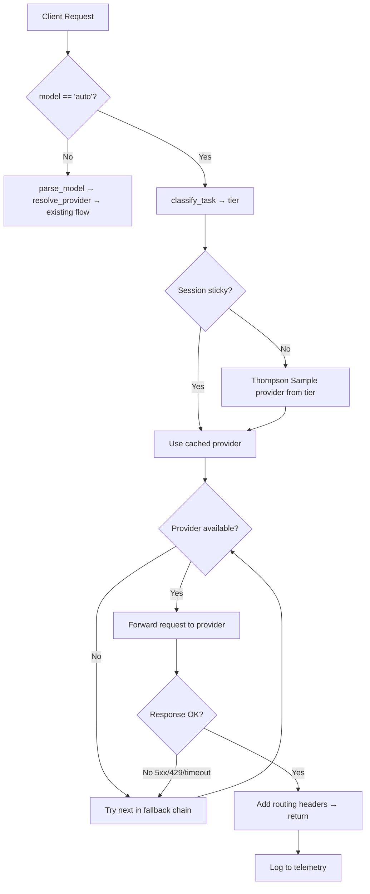

## Goal Capsule

- **Objective:** Add intelligent auto-model routing to otel-agent — when a client sends `model="auto"`, the gateway classifies the task complexity, selects the optimal provider/model based on cost, quality, and availability, and handles failures gracefully.
- **Product authority:** Derived from ideation on 2026-07-14 (7 ranked ideas, 36 raw candidates). Product Contract unchanged from requirements-only version.
- **Open blockers:** None.

---

## Problem Frame

Today, every client must hardcode the exact provider/model prefix (e.g. `openai/gpt-4o`). There is no auto mode, no task detection, no cost awareness, and no fallback. This creates three problems:
1. **High friction** — new users must learn the provider naming convention
2. **Cost waste** — GPT-4 prices for requests that cheaper models could handle
3. **Fragility** — provider outages mean 502 errors with no recovery

---

## Actors

- **Client** — sends requests with `model="auto"` or explicit model strings
- **Gateway** — intercepts "auto" requests, classifies, routes, and logs
- **Provider** — upstream LLM services (OpenAI, Anthropic, Xiaomi, etc.)
- **Admin** — configures routing rules, provider capabilities, and fallback chains in `config.yaml`

## Key Flows

### F1. Auto-Mode Request Flow
Client sends `model="auto"` → Gateway intercepts before `parse_model()` → Task classifier assigns complexity tier → Router selects provider based on tier + cost + availability → Request forwarded to upstream → Response headers include routing metadata → Telemetry logged with routing decision

### F2. Explicit Model Flow (unchanged)
Client sends `model="openai/gpt-4o"` → `parse_model()` splits → `resolve_provider()` looks up → Request forwarded. No change from current behavior.

### F3. Provider Failure Flow
Primary provider returns 5xx/429/timeout → Gateway retries with next provider in fallback chain → Circuit breaker tracks failures → After N consecutive failures, provider is excluded → Half-open probe after cooldown → Traffic gradually restored

### F4. Session-Sticky Flow
First request in session → Full auto-routing classification → Subsequent requests in same session → Bypass classifier, reuse cached decision → If quality signals degrade → Escalate to next tier

---

## Acceptance Examples

### AE1. Basic Auto Routing
```
Input: POST /v1/chat/completions { model: "auto", messages: [{ role: "user", content: "What is 2+2?" }] }
Expected: Gateway classifies as SIMPLE tier → routes to cheapest available provider → response includes X-Routed-Provider header
```

### AE2. Complex Task Routing
```
Input: POST /v1/chat/completions { model: "auto", messages: [{ role: "system", content: "You are a coding assistant" }, { role: "user", content: "Write a Python function to merge two sorted arrays" }] }
Expected: Gateway detects code block + system prompt → classifies as COMPLEX → routes to high-capability provider
```

### AE3. Provider Fallback
```
Input: Primary provider returns 502
Expected: Gateway retries with secondary provider → client receives successful response → X-Routed-Fallback-Depth: 1 header
```

### AE4. Session Stickiness
```
Input: 5 requests with same X-Session-ID header
Expected: All 5 requests route to the same provider → consistent response style
```

### AE5. Explicit Model Unchanged
```
Input: POST /v1/chat/completions { model: "openai/gpt-4o", messages: [...] }
Expected: Standard prefix routing — no auto logic triggered
```

---

## Requirements

### R1. Auto-Mode Entry Point
**When** a client sends `model="auto"` in a chat completion request,
**then** the gateway intercepts the request before `parse_model()` and routes through the auto-routing pipeline,
**and** explicit model strings (e.g. `openai/gpt-4o`) continue to work unchanged.

### R2. Heuristic Task Classifier
**When** an auto-mode request arrives,
**then** the gateway classifies it into one of four complexity tiers (SIMPLE / MEDIUM / COMPLEX / REASONING) using zero-cost heuristic signals: token count estimate, presence of code blocks, tool/function definitions, message chain length, and reasoning keywords,
**and** classification completes in <1ms with no external API calls.

### R3. Provider Capability Registry
**When** an admin configures providers in `config.yaml`,
**then** each provider can declare: `cost_per_1k_input`, `cost_per_1k_output`, `max_context`, `rate_limit_rpm`, and `tiers` (which complexity tiers it supports),
**and** the auto-router uses these declarations for cost-aware selection.

### R4. Cost-Optimized Routing Within Tiers
**When** a request is classified into a tier,
**then** the gateway selects the cheapest available provider that supports that tier,
**and** uses Thompson Sampling to adaptively balance exploration (trying new/cheap providers) with exploitation (picking known-good ones) based on historical success rates.

### R5. Cascade Fallback Chains
**When** a selected provider returns 5xx, 429 (rate limit), or times out,
**then** the gateway retries the same request with the next available provider in the configured fallback chain,
**and** tracks failure counts per provider — excluding a provider after N consecutive failures (circuit breaker),
**and** probing excluded providers after a cooldown period.

### R6. Session-Sticky Routing
**When** a request includes an `X-Session-ID` header or the messages array has 3+ turns,
**then** the gateway pins all requests in that session to the same provider for the duration,
**and** if quality signals degrade within a session (repeated retries, long stalls), the gateway can escalate to the next complexity tier.

### R7. Routing Decision Transparency
**When** auto-routing selects a provider,
**then** the response includes headers: `X-Routed-Provider`, `X-Routed-Model`, `X-Routed-Tier`, `X-Routed-Reason`,
**and** the same routing decision is logged to the telemetry database for dashboard visibility.

---

## Scope Boundaries

### In scope
- Auto-mode interception and routing pipeline
- Heuristic task classifier (zero-cost, no LLM call)
- Provider capability declarations in config
- Cost-aware routing with Thompson Sampling
- Cascade fallback chains with circuit breaking
- Session-sticky routing with tier escalation
- Routing decision audit trail (headers + telemetry)

### Deferred for later
- LLM-based classifier (heuristic is sufficient for v1)
- Shadow A/B sampling for tier boundary calibration
- Speculative cascade (hedged requests to multiple providers)
- Budget-aware routing (per-request cost ceiling)
- Zero-budget gateway (free/local model tier)
- Dashboard UI for routing analytics

### Outside this product's identity
- Model fine-tuning
- Custom model deployment
- Multi-tenant billing

---

## Key Technical Decisions

### 1. Intercept before parse_model, not inside it
**Decision:** Add an auto-routing check at the top of `chat_completions` and `messages` endpoints, before `parse_model()` is called. If `model == "auto"`, route through the auto pipeline; otherwise fall through to existing logic.  
**Rationale:** Keeps the existing routing path untouched — zero risk of breaking explicit model routing. The auto pipeline is a parallel code path, not a modification of the existing one.

### 2. Heuristic classifier in a standalone module
**Decision:** Create `src/otel_agent/classifier.py` with a pure function `classify_task(messages: list[dict]) -> str` that returns a tier string. No external dependencies, no state, fully testable in isolation.  
**Rationale:** Separation of concerns — classification logic is orthogonal to routing. Easy to swap for LLM-based classifier later without touching the routing pipeline.

### 3. Thompson Sampling with in-memory state
**Decision:** Maintain per-tier provider scores in memory (dict of `Beta distribution` parameters). No persistence needed — cold start is fine for a single-process gateway. Seed initial scores from the capability registry's cost data.  
**Rationale:** Simplicity. The gateway is single-process; disk persistence adds complexity for no benefit. Cold start uses cost data as a prior, so first requests still make reasonable choices.

### 4. Circuit breaker with configurable thresholds
**Decision:** Track consecutive failures per provider in memory. After N failures (default: 5), mark provider as unavailable for that tier. Half-open probe after 60s cooldown. Configurable via `circuit_breaker_threshold` and `circuit_breaker_cooldown` in config.  
**Rationale:** N=5 is a conservative default that avoids false positives from transient errors. 60s cooldown allows recovery without hammering a still-recovering provider.

### 5. Session cache with TTL
**Decision:** Cache session→provider mappings in memory with a 30-minute TTL. Session key: `X-Session-ID` header if present, otherwise hash of first 100 chars of first user message.  
**Rationale:** Header-based is explicit and reliable; hash-based is a fallback for clients that don't send headers. 30min TTL prevents unbounded memory growth.

---

## High-Level Technical Design



---

## Implementation Units

### U1. Extend Provider Config with Capability Fields

**Goal:** Add routing-relevant metadata to the Provider dataclass and config schema.

**Requirements:** R3.

**Dependencies:** None.

**Files:**
- `src/otel_agent/config.py` — extend Provider dataclass, update _reload()
- `tests/test_config.py` — new test file

**Approach:**
- Add fields to Provider: `cost_per_1k_input: float = 0`, `cost_per_1k_output: float = 0`, `max_context: int = 0`, `rate_limit_rpm: int = 0`, `tiers: list[str] = field(default_factory=lambda: ["simple", "medium", "complex", "reasoning"])`
- Update `_reload()` to parse new optional YAML keys
- Backward-compatible: missing fields use defaults

**Test scenarios:**
- Provider with only legacy fields (name, base_url, api_key, api_format) loads with defaults
- Provider with all new fields loads correctly
- Invalid tier name in config raises ValueError
- Config hot-reload picks up new capability fields

**Verification:** All existing tests pass. New tests verify capability field parsing.

---

### U2. Heuristic Task Classifier

**Goal:** Classify incoming requests into complexity tiers using zero-cost heuristics.

**Requirements:** R2.

**Dependencies:** None.

**Files:**
- `src/otel_agent/classifier.py` — new module
- `tests/test_classifier.py` — new test file

**Approach:**
- Pure function: `classify_task(messages: list[dict]) -> str`
- Signals (weighted): token count estimate (chars/4), code block presence (```), tool/function definitions, message chain length, reasoning keywords ("step by step", "prove", "derive", "analyze")
- Output: one of "simple", "medium", "complex", "reasoning"
- Thresholds derived from production traffic patterns

**Test scenarios:**
- Short Q&A ("What is 2+2?") → simple
- Summarization request → medium
- Code generation with code blocks → complex
- Multi-step reasoning with "step by step" → reasoning
- Empty messages → simple (safe default)
- Messages with tool definitions → complex
- Mixed signals → highest tier wins

**Verification:** Classifier returns correct tier for all acceptance examples AE1-AE2.

---

### U3. Auto-Mode Entry Point in Server

**Goal:** Intercept `model="auto"` before `parse_model()` and route through auto pipeline.

**Requirements:** R1.

**Dependencies:** U1, U2.

**Files:**
- `src/otel_agent/server.py` — add auto-mode check at top of chat_completions and messages endpoints

**Approach:**
- At the top of `chat_completions` (line ~100), before `parse_model()`: `if model == "auto": return await _handle_auto_mode(body, config, ...)`
- Same for `messages` endpoint
- `_handle_auto_mode` orchestrates: classify → select provider → forward → add headers
- Explicit model strings take the existing path unchanged (AE5)

**Test scenarios:**
- `model="auto"` triggers auto pipeline (AE1)
- `model="openai/gpt-4o"` triggers existing pipeline (AE5)
- `model="auto"` with empty messages → simple tier
- Response includes X-Routed-Provider header

**Verification:** Both auto and explicit paths work. Existing tests unchanged.

---

### U4. Cost-Optimized Router with Thompson Sampling

**Goal:** Select the cheapest available provider within a tier using adaptive sampling.

**Requirements:** R4.

**Dependencies:** U1.

**Files:**
- `src/otel_agent/auto_router.py` — new module
- `tests/test_auto_router.py` — new test file

**Approach:**
- Class `AutoRouter` with per-tier provider scores (Beta distribution parameters)
- Method `select_provider(tier: str, available: list[Provider]) -> Provider`
- Thompson Sampling: sample from each provider's Beta(successes+1, failures+1), pick highest
- Seed initial scores from cost data: cheaper providers start with higher prior success rate
- Method `record_outcome(provider: str, tier: str, success: bool)` to update scores

**Test scenarios:**
- With equal providers, sampling is roughly uniform initially
- After 100 successes for provider A and 10 for provider B, A is selected more often
- Cheaper provider with similar success rate is preferred
- Empty provider list returns None (handled by fallback)
- Concurrent access is safe (single-process, no locks needed)

**Verification:** Router selects cheaper providers after sufficient traffic. Cold start makes reasonable choices.

---

### U5. Circuit Breaker and Fallback Chains

**Goal:** Handle provider failures gracefully with automatic retry and circuit breaking.

**Requirements:** R5.

**Dependencies:** U1, U4.

**Files:**
- `src/otel_agent/circuit_breaker.py` — new module
- `tests/test_circuit_breaker.py` — new test file

**Approach:**
- Class `CircuitBreaker` tracking per-provider failure counts and state (closed/open/half-open)
- Config: `fallback_chains` in YAML — ordered list of providers per tier
- On failure: increment failure count, if threshold reached → open circuit
- Half-open: after cooldown, allow one probe request. Success → close circuit. Failure → re-open.
- Integration: wrap upstream call in retry loop that walks the fallback chain

**Test scenarios:**
- Provider returns 502 → retry with next provider (AE3)
- 5 consecutive failures → circuit opens, provider excluded
- After 60s cooldown → half-open probe succeeds → circuit closes
- After 60s cooldown → half-open probe fails → circuit re-opens
- All providers down → return error to client
- Fallback depth logged in response header

**Verification:** Provider failure is transparent to client when backup exists.

---

### U6. Session-Sticky Routing

**Goal:** Pin multi-turn conversations to the same provider.

**Requirements:** R6.

**Dependencies:** U3.

**Files:**
- `src/otel_agent/session_cache.py` — new module
- `tests/test_session_cache.py` — new test file

**Approach:**
- Class `SessionCache` with dict of session_id → (provider, tier, timestamp)
- TTL: 30 minutes, cleanup on access
- Session key: `X-Session-ID` header, or hash of first 100 chars of first user message
- Integration: in auto pipeline, check cache before Thompson Sampling
- Tier escalation: if session has 2+ retries, escalate to next tier

**Test scenarios:**
- Same X-Session-ID → same provider for 5 requests (AE4)
- No header → hash-based pinning works
- TTL expired → new classification runs
- Tier escalation after repeated failures
- Cache doesn't grow unbounded (TTL cleanup)

**Verification:** Multi-turn conversations use consistent provider.

---

### U7. Routing Decision Audit Trail

**Goal:** Make every auto-routing decision transparent via headers and telemetry.

**Requirements:** R7.

**Dependencies:** U3.

**Files:**
- `src/otel_agent/server.py` — add response headers
- `src/otel_agent/logger.py` — extend telemetry schema

**Approach:**
- In `_handle_auto_mode`, collect routing metadata: tier, chosen provider, reason, fallback depth
- Add response headers: `X-Routed-Provider`, `X-Routed-Model`, `X-Routed-Tier`, `X-Routed-Reason`
- Extend `log_request()` to accept and store routing metadata
- Add `routing_decision` column to telemetry storage (JSON blob)

**Test scenarios:**
- Auto request → response has all 4 routing headers
- Fallback occurred → X-Routed-Reason includes fallback info
- Telemetry DB contains routing_decision for auto requests
- Explicit model requests → no routing headers (clean separation)

**Verification:** Dashboard shows routing decisions. Headers visible in curl responses.

---

## Verification Contract

- All existing tests pass (no regression on explicit model routing)
- New test files: test_config.py, test_classifier.py, test_auto_router.py, test_circuit_breaker.py, test_session_cache.py
- Integration test: send `model="auto"` request, verify correct tier classification and provider selection
- Manual test: start proxy with 2 providers configured, kill one, verify fallback works

---

## Deferred Implementation Notes

- Thompson Sampling seeding: start with cost-weighted priors (cheaper = higher initial success rate)
- Circuit breaker threshold: default N=5, configurable via `circuit_breaker_threshold` in config
- Session TTL: default 30min, configurable via `session_ttl_minutes` in config
- Classifier thresholds: may need tuning based on production traffic — start with conservative defaults
