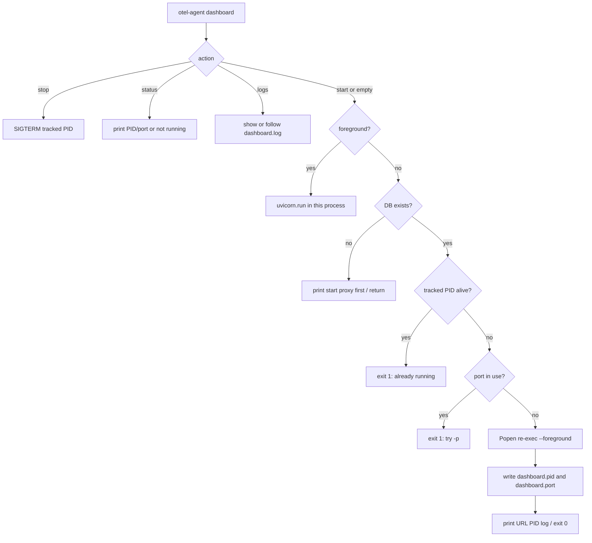

## Goal Capsule

- **Objective:** Make `otel-agent dashboard` return immediately after starting a detached dashboard process, matching `otel-agent proxy`, with an explicit foreground escape hatch and a way to stop the daemon.
- **Product authority:** User request that dashboard start should run in the background by default.
- **Open blockers:** None.
- **Execution profile:** code.
- **Stop conditions:** Background start, already-running/port-in-use/missing-db paths, `--foreground`, and stop/status are covered by tests; README documents the new default.
- **Tail ownership:** Implementer owns verification; no launch-blocking product questions remain.

---

## Product Contract

### Summary

`otel-agent dashboard` currently blocks on `uvicorn.run`. Users who start the standalone dashboard lose the terminal. The proxy already backgrounds by default. Dashboard start should do the same: detach, print URL/PID/log path, and exit. `--foreground` keeps the old blocking server for debugging. Lifecycle commands (`stop`, `status`, `logs`) make the daemon operable.

### Problem Frame

Standalone dashboard is a long-lived HTTP server. Foreground-only start forces `&` or a second terminal. After backgrounding, there is no PID file or stop path, so a default-background change without lifecycle commands would leave an orphan process.

### Requirements

**Start behavior**
- R1. `otel-agent dashboard` starts the dashboard in the background and returns the shell promptly.
- R2. Successful background start prints the URL, PID, and log file path.
- R3. `otel-agent dashboard --foreground` (also `-f`) runs the existing blocking uvicorn server.

**Operability**
- R4. A second `otel-agent dashboard` while one is already running fails with a message that names `otel-agent dashboard stop`.
- R5. `otel-agent dashboard stop` stops the tracked dashboard process and cleans PID/port files.
- R6. `otel-agent dashboard status` reports running PID/port or that it is not running.
- R7. `otel-agent dashboard logs` shows recent dashboard log lines; `-F/--follow` streams them.

**Safety**
- R8. Missing database still prints the current "Start the proxy first" guidance and does not spawn a process.
- R9. A port already in use fails before spawn, with a message that suggests `-p`.
- R10. Proxy and dashboard may run at the same time; their PID/log files must not collide.

**Docs**
- R11. README command list and Web Dashboard section describe background default, `--foreground`, and stop/status/logs.

### Actors

- A1. Developer starting the standalone dashboard from a terminal.

### Key Flows

- F1. Default start
  - **Trigger:** A1 runs `otel-agent dashboard`.
  - **Steps:** Validate DB exists; refuse if already running or port busy; spawn detached process; write PID/port; print URL/PID/log; CLI exits.
  - **Outcome:** Dashboard listens on :9090; shell is free.
  - **Covered by:** R1, R2, R8, R9, R10
- F2. Foreground start
  - **Trigger:** A1 runs `otel-agent dashboard -f`.
  - **Steps:** Run the current uvicorn server in-process until Ctrl+C.
  - **Outcome:** Terminal stays attached.
  - **Covered by:** R3
- F3. Stop
  - **Trigger:** A1 runs `otel-agent dashboard stop`.
  - **Steps:** SIGTERM the tracked PID; SIGKILL after timeout; remove PID/port files.
  - **Outcome:** Process gone; status reports not running.
  - **Covered by:** R5, R6

### Acceptance Examples

- AE1. Covers F1 / R1 / R2. Given a telemetry DB exists and nothing listens on 9090, when the user runs `otel-agent dashboard`, then the command exits quickly, prints `http://localhost:9090` plus PID and log path, and the process is still listening.
- AE2. Covers F2 / R3. Given the same DB, when the user runs `otel-agent dashboard --foreground`, then the process stays in the foreground and prints the existing SQLite standalone note (no DuckDB wording).
- AE3. Covers R4. Given a dashboard is already tracked as running, when the user starts again, then the CLI exits non-zero and mentions `otel-agent dashboard stop`.
- AE4. Covers F3 / R5. Given a tracked dashboard PID, when the user runs `otel-agent dashboard stop`, then that process is gone and status reports not running.

### Success Criteria

- Default start no longer blocks the terminal.
- Users can stop and inspect the daemon without hunting PIDs.
- Existing `dashboard -p` / `-d` / `--proxy` flags keep working on the start path.

### Scope Boundaries

**In scope**
- Dashboard CLI start default, `--foreground`, and stop/status/logs.
- Dashboard-specific PID/port/log files under `~/.otel-agent/`.
- Tests and README.

**Deferred for later**
- Opening a browser automatically after start.
- systemd/launchd service units.
- Auto-detecting a running proxy and passing `--proxy`.

**Outside this product's identity**
- Changing the in-proxy dashboard (already served on the proxy port).
- Dashboard UI changes.

**Deferred to Follow-Up Work**
- Generalizing `process.py` into a multi-daemon framework beyond proxy + dashboard files.

### Assumptions

- Background means the same detach model as proxy: `subprocess.Popen(..., start_new_session=True)` re-executing the CLI with `--foreground`, not a Unix double-fork daemonize.
- Lifecycle subcommands are in scope even though the user only named the start default; without them a background default is not operable.
- `otel-agent dashboard` with no subcommand remains start, so existing flag usage is unchanged.
- Product Contract is bootstrap-only; no upstream brainstorm.

---

## Planning Contract

### Key Technical Decisions

- KTD1. Reuse the proxy spawn contract, not a new daemon library.
  Rationale: `src/otel_agent/commands/proxy.py` already backgrounds via re-exec + PID file + log append. Dashboard should copy that flow so behavior and tests stay familiar.

- KTD2. Keep dashboard process files separate from proxy.
  Rationale: R10. Use `~/.otel-agent/dashboard.pid`, `dashboard.port`, and `dashboard.log`. Do not reuse `proxy.pid`.

- KTD3. Add dashboard lifecycle the same way proxy does, without requiring `start` in the command line.
  Rationale: `otel-agent proxy` already defaults to start while accepting `stop|status|logs`. Dashboard should grow a `dashboard_action` subparser the same way so `otel-agent dashboard -p 3000` still parses.

- KTD4. Extract only a thin named-file helper if duplication hurts tests; otherwise duplicate the small PID helpers next to dashboard code or parameterize `process.py` with a name prefix.
  Rationale: `process.py` is proxy-hardcoded today. Implementer may either add `dashboard_*` helpers in that module or parameterize file paths. Do not redesign process management.

- KTD5. Foreground path stays the current `handle_dashboard` uvicorn body, including the SQLite-not-DuckDB note.
  Rationale: `tests/test_cli.py::test_handle_dashboard_startup_note_says_sqlite_not_duckdb` must keep passing against the foreground path.

### High-Level Technical Design

### Sequencing

U1 process files, then U2 CLI behavior, then U3 tests and README (can overlap U2 if tests are written first).

---

## Implementation Units

### U1. Dashboard daemon files and stop/status helpers

- **Goal:** Track a dashboard process independently from the proxy.
- **Requirements:** R5, R6, R10
- **Dependencies:** none
- **Files:** `src/otel_agent/process.py`, `tests/test_process.py`
- **Approach:** Add dashboard PID/port/log paths and read/write/status/stop helpers that mirror the proxy helpers. Keep proxy helpers working unchanged. Prefer a small shared helper keyed by name (`proxy` vs `dashboard`) if that avoids copy-paste; otherwise add parallel functions.
- **Patterns to follow:** `src/otel_agent/process.py` and `tests/test_process.py` (tmp_path + patch file constants).
- **Test scenarios:**
  - Happy path: write dashboard PID, read it back, status returns pid/port.
  - Edge: missing or invalid PID file returns not-running; stale PID is cleaned.
  - Error: stop with no process returns false and does not raise.
  - Isolation: dashboard helpers do not read or write `proxy.pid`.
- **Verification:** Existing proxy process tests still pass; new dashboard file tests pass.

### U2. Background-default dashboard CLI

- **Goal:** Default start detaches; `--foreground` blocks; stop/status/logs manage the daemon.
- **Requirements:** R1–R9, R11 (CLI surface only)
- **Dependencies:** U1
- **Files:** `src/otel_agent/cli.py`, `src/otel_agent/commands/dashboard.py`
- **Approach:** Add `-f/--foreground` on the dashboard parser. Add optional `dashboard_action` subparsers (`stop`, `status`, `logs`) the same way proxy does, defaulting missing action to start. Background start: refuse already-running and port-in-use; spawn `sys.executable -m otel_agent dashboard --foreground` with the same `-p/-d/--proxy` values; redirect stdout/stderr to `dashboard.log`; `start_new_session=True`; write PID/port; brief alive check. Missing DB stays a no-spawn return on both start modes. Do not take `-d` for detach; it remains `--db`.
- **Patterns to follow:** `handle_proxy_start` / `handle_proxy_stop` / `handle_proxy_status` / `handle_proxy_logs` in `src/otel_agent/commands/proxy.py`.
- **Execution note:** Keep the current uvicorn body as the `--foreground` implementation so the SQLite startup note does not regress.
- **Test scenarios:** see U3.
- **Verification:** `otel-agent dashboard --help` shows `--foreground` and lifecycle actions; default parse has `foreground` false.

### U3. Tests and README

- **Goal:** Lock the new default and document it.
- **Requirements:** R1–R11
- **Dependencies:** U2
- **Files:** `tests/test_cli.py`, `README.md`
- **Approach:** Update the SQLite startup-note test to pass `foreground=True` (or call the foreground runner). Add parser tests for default background, `-f`, and `stop`. Add handler tests that stub `subprocess.Popen` / process helpers rather than binding a real port when that is enough. Document background default, `--foreground`, stop, status, and logs next to the existing dashboard examples.
- **Patterns to follow:** `tests/test_cli.py` argparse and capsys style; README proxy command list.
- **Test scenarios:**
  - Happy path: `parse_args(["dashboard"])` is not foreground; background handler with mocked Popen writes/prints PID and URL then returns.
  - Happy path: foreground handler with mocked `uvicorn.run` still prints `Direct SQLite access used.` and never `DuckDB`.
  - Covers AE3: already-running status causes non-zero exit and mentions `dashboard stop`.
  - Error: missing DB prints the proxy-first message and does not call Popen.
  - Error: port-in-use prints a `-p` hint and does not call Popen.
  - Integration-lite: stop helper invoked by `dashboard stop` when a PID is tracked.
- **Verification:** `pytest tests/test_cli.py tests/test_process.py` passes. README examples no longer imply a blocking start.

---

## Verification Contract

| Gate | Command / check | Applies to |
|---|---|---|
| Process helpers | `pytest tests/test_process.py` | U1 |
| CLI + dashboard start | `pytest tests/test_cli.py` | U2, U3 |
| Broader regression | `pytest -m "not integration"` | Definition of Done |
| Docs | README command list mentions background, `--foreground`, and `dashboard stop` | U3 |

---

## Definition of Done

- R1–R11 are implemented and traced through U1–U3.
- Default `otel-agent dashboard` does not call `uvicorn.run` in the parent process.
- Proxy daemon files and proxy tests are unchanged in behavior.
- Abandoned experimental helpers are removed from the diff.
- README matches the shipped CLI.
