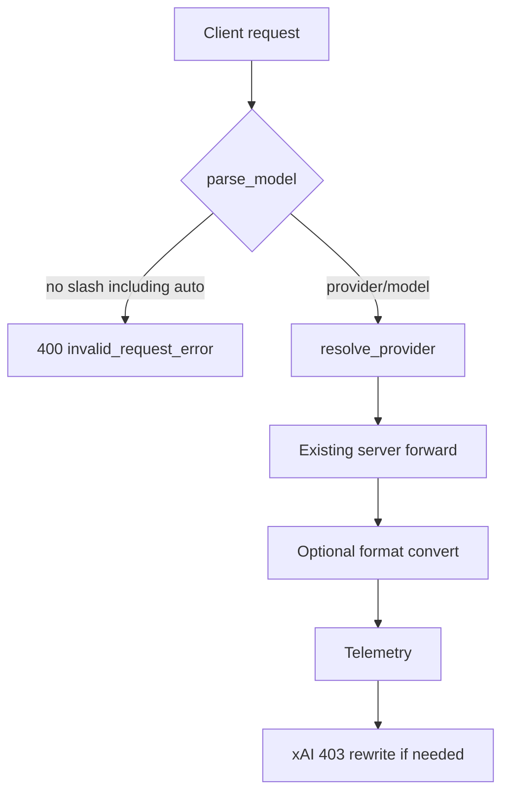

# Remove Auto Model - Plan

## Goal Capsule

- **Objective:** Clients can no longer select otel-agent's synthetic `auto` model; chat and messages requests use explicit `provider/model` only.
- **Means:** Delete the auto-routing stack and the intercept that served `model=auto` (KTD1, KTD2).
- **Product authority:** User request via ce-plan (2026-09-08); no upstream brainstorm.
- **Stop when:** Bare `auto` is rejected like any unprefixed model, `/v1/models` no longer lists it, and Cursor `auto` mapping still works.
- **Open blockers:** None.

---

## Product Contract

### Summary

Remove otel-agent's first-party synthetic `auto` model and every module that exists only to serve it. Explicit `provider/model` routing stays. Cursor's own `auto` stays.

### Problem Frame

The gateway intercepts `model="auto"` and runs a classifier, Thompson Sampling bandit, circuit breaker, and session cache. That path is unused product surface. Leaving it in place keeps a second request pipeline, extra config fields, and docs that describe behavior operators no longer want.

### Key Decisions

- Remove the whole auto-routing stack, not only the model id. (session-settled: user-directed — chosen over keeping classifier/router/breaker/cache for reuse: leftover modules would stay dead.) Governs R1, R4, R5.
- Leave Cursor `cursor/auto` and sidecar `auto` mapping alone. (session-settled: user-directed — chosen over treating Cursor auto as in-scope: that id is Cursor's product.) Governs R6.

### Requirements

**Gateway contract**

- R1. `POST /v1/chat/completions` and `POST /v1/messages` with `model` equal to `auto` do not enter a special pipeline.
- R2. Those requests fail with the same invalid-model error as any other string that lacks a `provider/` prefix.
- R3. `GET /v1/models` does not include an `id` of `auto` owned by `otel-agent`.

**Removal**

- R4. Classifier, Thompson Sampling router, auto circuit breaker, and auto session cache are gone from production code.
- R5. Provider and config fields that exist only for auto-routing are gone from load and from the default config template. Unknown leftover YAML keys on disk are ignored, not fatal.

**Keep**

- R6. Cursor sidecar mapping for CLI id `auto` is unchanged.
- R7. Explicit `provider/model` forwarding, format conversion, telemetry, and SuperGrok 403 rewrite stay on the existing server path.

### Success Criteria

- A client that still sends `model=auto` gets a 400 invalid-model response, not a routed completion.
- `/v1/models` lists only prefixed provider models.
- Cursor tests that pin `auto` still pass.

### Actors

- A1. Gateway client — sends chat or messages with a model string.
- A2. Operator — maintains `~/.otel-agent/config.yaml` and may still have auto-routing keys.
- A3. Cursor sidecar — maps CLI model ids, including Cursor's `auto`.

### Key Flows

- F1. Bare `auto` request
  - **Trigger:** Client posts chat or messages with `model: "auto"`.
  - **Steps:** Endpoint reads model; `parse_model` rejects missing `/`; client gets 400.
  - **Covered by:** R1, R2.
- F2. Explicit model request
  - **Trigger:** Client posts `openai/gpt-4o` (or any prefixed id).
  - **Steps:** Parse, resolve provider, forward, convert if needed, log, rewrite xAI 403 if applicable.
  - **Covered by:** R7.
- F3. Models list
  - **Trigger:** Client GETs `/v1/models`.
  - **Steps:** Aggregate prefixed provider models; do not append synthetic `auto`.
  - **Covered by:** R3.

### Acceptance Examples

- AE1. Bare auto rejected
  - **Covers:** R1, R2, F1.
  - **Given:** Gateway is running with at least one provider.
  - **When:** `POST /v1/chat/completions` with `{ "model": "auto", "messages": [...] }`.
  - **Then:** 400 with `invalid_request_error`; body mentions provider prefix; no `X-Routed-*` headers.
- AE2. Anthropic path matches
  - **Covers:** R1, R2.
  - **When:** `POST /v1/messages` with `model: "auto"`.
  - **Then:** Same 400 class as AE1.
- AE3. Models list has no synthetic auto
  - **Covers:** R3, F3.
  - **When:** Aggregate models from one or more providers, including empty input.
  - **Then:** No `id` `auto` with `owned_by` `otel-agent`.
- AE4. Prefixed model unchanged
  - **Covers:** R7, F2.
  - **When:** `POST /v1/chat/completions` with `model: "openai/gpt-4o"`.
  - **Then:** Request forwards on the explicit path; no routing headers.
- AE5. Cursor auto mapping
  - **Covers:** R6.
  - **When:** Sidecar maps CLI id `auto`.
  - **Then:** Result is still `auto` (unprefixed).

### Scope Boundaries

- In: gateway synthetic `auto`, auto-routing modules, auto-only config, tests that assert that surface, live glossary that names the stack.
- Out: Cursor `auto`; CSS `overflow: auto`; historical plans under `docs/plans/` that added auto-routing; rewriting git history.
- Deferred to follow-up: scanning operators' on-disk YAML to delete leftover keys (ignored at load is enough, per R5).

---

## Planning Contract

### Key Technical Decisions

- KTD1. Full-stack delete. Remove `auto_handler.py`, `auto_router.py`, `classifier.py`, `circuit_breaker.py`, and `session_cache.py`. Production imports of those modules exist only from `auto_handler`. (session-settled: user-directed — chosen over keeping unused modules for reuse: prior auto-routing work already left dead getters.) Instantiates the stack-removal Key Decision; governs R4.
- KTD2. No special-case error for `auto`. After the intercept is gone, `parse_model("auto")` already raises because there is no `/`. Return that 400. Do not add an `auto`-specific message. Instantiates R1, R2.
- KTD3. Strip auto-only config, ignore leftovers. Drop `Provider` fields `cost_per_1k_input`, `cost_per_1k_output`, `max_context`, `rate_limit_rpm`, `tiers`, `default_model`; drop `supports_auto_routing`, `cost_per_token`, `VALID_TIERS`, `get_providers_for_tier`, and `auto_routing`. Stop validating `tiers`. Extra YAML keys remain harmless because load only reads known fields. Instantiates R5.
- KTD4. SuperGrok 403 stays on `server.py`. `auto_handler` also rewrites xAI 403, but `server._handle_non_streaming` already does. Deleting the handler must not remove `xai_errors.py`. Instantiates R7.
- KTD5. Live docs only. Update `CONCEPTS.md` Auto-Routing block and the `AGENTS.md` glossary blurb. Delete `docs/solutions/logic-errors/auto-routing-seed-bias-and-fallback-order.md` because it documents a removed module. Leave historical `docs/plans/2026-07-14-003-feat-auto-model-routing-plan.md` in place.

### High-Level Technical Design

Deleted path (do not reintroduce): `model == "auto"` intercept → classify → session cache → breaker + `get_providers_for_tier` → Thompson select → `default_model` → duplicate forward.

### Assumptions

- Operators who still send `model=auto` will switch to prefixed ids; no migration helper.
- On-disk `auto_routing` / cost YAML may remain; ignoring it is enough.

### Sequencing

U1 intercept and models list first so behavior changes with tests. U2 delete modules. U3 strip config. U4 docs. U2 may land with U1 if imports would otherwise fail; do not leave a server intercept that imports a deleted handler.

---

## Implementation Units

### U1. Stop intercepting auto and drop the synthetic list entry

- **Goal:** Bare `auto` is an invalid model; `/v1/models` no longer advertises it.
- **Requirements:** R1, R2, R3, R6, R7
- **Dependencies:** None
- **Files:**
  - `src/otel_agent/server.py`
  - `src/otel_agent/models.py`
  - `tests/test_models.py`
  - `tests/test_server.py`
  - `tests/test_auto_mode_integration.py` (replace or delete in this unit so CI does not keep the old contract)
  - `tests/test_cursor_sidecar.py` (do not change mapping assertions)
- **Approach:**
  1. Remove `if model == "auto": handle_auto_mode(...)` from both chat and messages endpoints.
  2. Remove the synthetic `{id: "auto", owned_by: "otel-agent"}` append in `aggregate_models`.
  3. Rewrite models-list tests that count `auto` / `otel-agent`.
  4. Add chat and messages tests for AE1/AE2, or convert the old integration file into those cases.
  5. Leave `cursor_cli_model_for_sidecar("auto")`.
- **Patterns to follow:** Existing `parse_model` ValueError → 400 `invalid_request_error` in `server.py`. `test_v1_models_is_json_not_spa_html` for `/v1/models` JSON shape.
- **Test scenarios:**
  - Covers AE1. Chat completions with `model: "auto"` returns 400; error type is `invalid_request_error`; no `X-Routed-Provider`.
  - Covers AE2. Messages with `model: "auto"` returns the same 400 class.
  - Covers AE4. Prefixed `openai/gpt-4o` still does not set routing headers (keep or port the existing negative assertion from the old integration test).
  - Covers AE3. `aggregate_models` with two provider models returns only those ids; empty input returns `{object: list, data: []}`.
  - Covers AE3. Sorted providers no longer end with `otel-agent`.
  - Covers AE5. `cursor_cli_model_for_sidecar("auto") == "auto"` still holds.
  - `/v1/models` JSON test no longer requires an `auto` id.
- **Verification:** Models-list unit tests and the new 400 tests pass. Cursor sidecar tests still pass.

### U2. Delete auto-routing modules and their tests

- **Goal:** No production or test module remains for the deleted stack.
- **Requirements:** R4
- **Dependencies:** U1
- **Files:**
  - Delete `src/otel_agent/auto_handler.py`
  - Delete `src/otel_agent/auto_router.py`
  - Delete `src/otel_agent/classifier.py`
  - Delete `src/otel_agent/circuit_breaker.py`
  - Delete `src/otel_agent/session_cache.py`
  - Delete `tests/test_auto_router.py`
  - Delete `tests/test_breaker_cache.py`
  - Delete `tests/test_classifier.py`
  - Delete `tests/test_auto_mode_integration.py` if U1 did not already replace it
- **Approach:**
  1. Delete the five modules after U1 removed the only production importer.
  2. Delete unit tests that import them.
  3. Grep for `handle_auto_mode`, `AutoRouter`, `classify_task`, `CircuitBreaker`, `SessionCache` under `src/` and `tests/` and clear leftovers.
  4. Do not delete `xai_errors.py` or `server.py` 403 rewrite (KTD4).
- **Patterns to follow:** Prior auto-routing learning: do not leave unused getters or half-deleted helpers (`docs/solutions/logic-errors/auto-routing-seed-bias-and-fallback-order.md`, removed in U4).
- **Test scenarios:**
  - Importing `otel_agent.auto_handler` (and the other four modules) fails because the files are gone.
  - Explicit-path xAI 403 rewrite still has coverage via existing `tests/test_xai_errors.py` / server tests; do not drop those while deleting auto_handler.
- **Verification:** `uv run pytest tests/ -q -m "not integration"` collects without missing-module errors.

### U3. Strip auto-only config fields

- **Goal:** Provider and Config no longer model auto-routing.
- **Requirements:** R5
- **Dependencies:** U2
- **Files:**
  - `src/otel_agent/config.py`
  - `tests/test_config.py` if any new coverage is needed
- **Approach:**
  1. Remove auto capability fields and helpers listed in KTD3.
  2. Remove auto comments from `DEFAULT_CONFIG`.
  3. Keep `name`, `base_url`, `api_key`, `api_format`, `auth`.
  4. Confirm a YAML file that still has `auto_routing` or `cost_per_1k_input` still loads.
- **Patterns to follow:** Existing `_validate` for `base_url`, `api_key`/`auth`, `api_format` only.
- **Test scenarios:**
  - Provider YAML with only name/base_url/api_key/api_format still loads.
  - YAML that still contains `auto_routing` and `cost_per_1k_input` loads and does not expose those as Config API.
  - Invalid `api_format` still raises; invalid `tiers` is no longer a load error.
- **Verification:** Config tests pass; no remaining `VALID_TIERS` / `get_providers_for_tier` references under `src/`.

### U4. Update live glossary and retire the auto-routing solution doc

- **Goal:** Current docs do not describe a removed feature as live.
- **Requirements:** R4, R6
- **Dependencies:** U2, U3
- **Files:**
  - `CONCEPTS.md`
  - `AGENTS.md`
  - Delete `docs/solutions/logic-errors/auto-routing-seed-bias-and-fallback-order.md`
- **Approach:**
  1. Remove the Auto-Routing glossary block (Thompson Sampling through Seed From Costs). Keep Sidecar Auth Vault and SuperGrok Grant.
  2. Change the `AGENTS.md` CONCEPTS blurb so it no longer names Thompson Sampling / Circuit Breaker / Tier as live vocabulary.
  3. Delete the solutions doc that is only about the removed stack.
  4. Do not edit historical plans.
- **Test expectation:** none -- documentation-only.
- **Verification:** `CONCEPTS.md` has no Auto-Routing section; `AGENTS.md` does not point readers at those terms; README still documents `cursor/auto` only as Cursor.

---

## Verification Contract

Repo test command from README: `uv run pytest tests/ -v -m "not integration"`.

| Gate | Applies | Signal |
| --- | --- | --- |
| Models aggregate + `/v1/models` | U1 | No synthetic `auto`; empty aggregate is empty list |
| Chat/messages `model=auto` | U1 | 400 `invalid_request_error` |
| Cursor sidecar | U1, R6 | `tests/test_cursor_sidecar.py` unchanged mapping |
| Module deletion | U2 | Auto tests gone; collection succeeds |
| Config load | U3 | Leftover YAML ignored; core validation intact |
| xAI 403 | U2, R7 | Existing xAI tests still pass |

---

## Definition of Done

- R1–R7 hold in tests listed above.
- No `src/` imports of deleted auto modules.
- `CONCEPTS.md` Auto-Routing section is gone; Sidecar Auth Vault remains.
- Cursor `auto` mapping and README `cursor/auto` remain.
- Abandoned partial rewrites (half-kept breaker, leftover intercept) are not in the diff.

---

## System-Wide Impact

- Public API: `/v1/models` shrinks by one synthetic id; `model=auto` becomes invalid.
- Config: optional auto fields stop being first-class; leftover keys ignored.
- Telemetry: `x-routing-decision` extra header goes away with auto_handler.
- No dashboard or storage schema change.

---

## Risks & Dependencies

- Risk: grep miss leaves a test importing deleted modules. Mitigation: collect pytest after U2.
- Risk: treating Cursor `auto` as the same token. Mitigation: R6 / AE5; do not edit `cursor_sidecar.py` mapping.
- Risk: deleting 403 rewrite with auto_handler. Mitigation: KTD4; keep `server.py` path.

---

## Documentation / Operational Notes

Operators who used `model=auto` must switch to `provider/model`. No config migration command. Historical plan `docs/plans/2026-07-14-003-feat-auto-model-routing-plan.md` is not live docs.

---

## Sources / Research

- Intercept: `src/otel_agent/server.py` chat and messages `model == "auto"`.
- Synthetic list: `src/otel_agent/models.py` `aggregate_models`.
- Parse reject: `src/otel_agent/router.py` `parse_model` requires `/`.
- Cursor keep: `src/otel_agent/cursor_sidecar.py` `cursor_cli_model_for_sidecar`.
- 403 keep: `src/otel_agent/server.py` `_handle_non_streaming`; `src/otel_agent/xai_errors.py`.
- Auto-only production importers: `auto_handler.py` only.
- Learning: `docs/solutions/logic-errors/auto-routing-seed-bias-and-fallback-order.md` (delete in U4).
