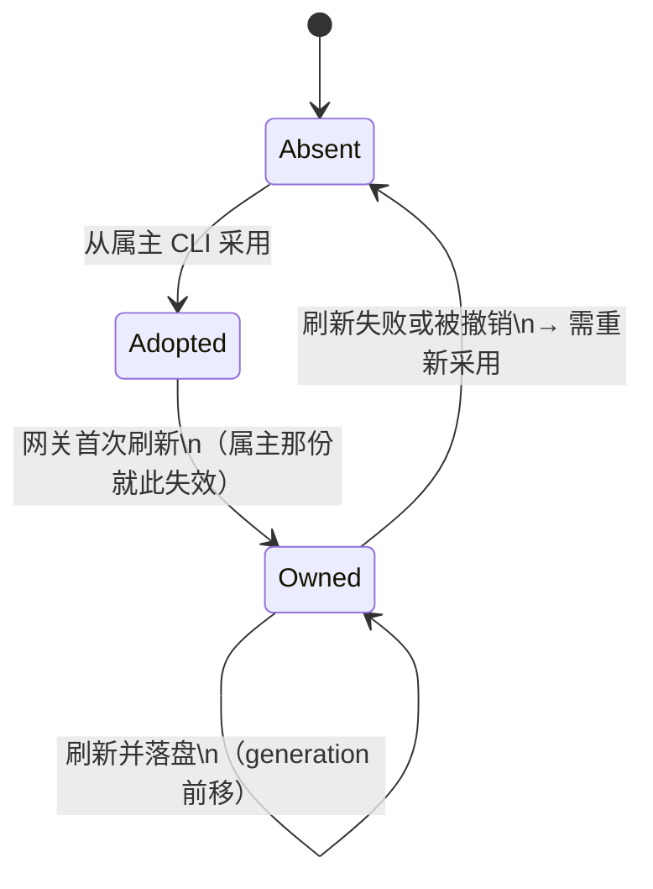
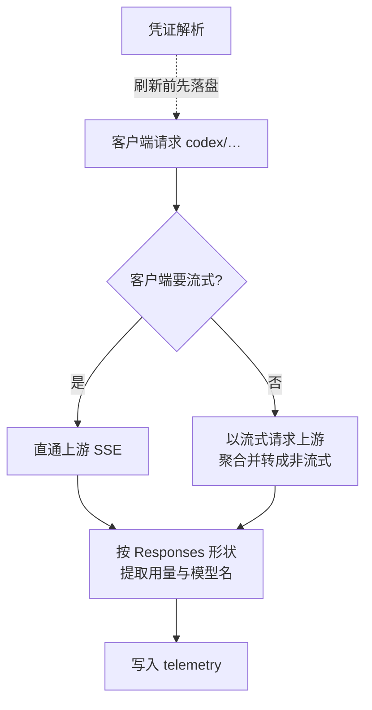
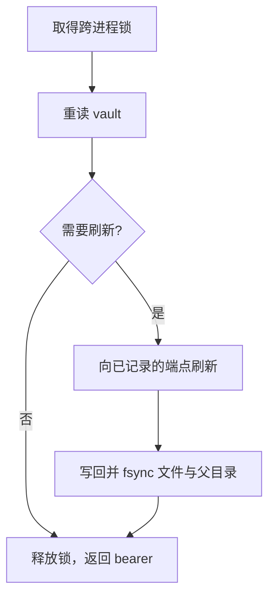

# Codex Subscription Provider - Plan

## Goal Capsule

- **Objective:** otel-agent 成为 ChatGPT Plus / Codex 订阅的唯一出口——网关自己持有并刷新这条凭证，并把上游那条只接受流式的 Responses 通路交给现有客户端。达成后，任何指向网关的客户端都能用 `codex/…` 拿到真实回答，且网关不再依赖任何兄弟 CLI 存活。
- **Means:** 把订阅凭证从「按名字特判的模式」改成「按声明处理的来源」，并为 Responses 通路加一条不翻译的直通路由。
- **Product authority:** 既有的本地网关形状（provider 前缀路由、telemetry、dashboard）不变；本次只扩展网关的一种能力。xAI 路径不迁移，两套形状并存是有意的。
- **Open blockers:** 无阻塞项。有两条外部事实必须在实现前用一次真实抓包确认（见 Dependencies / Assumptions）。

---

## Product Contract

Product Contract preservation: **clarified, no scope change** — AE2 的模型清单分支收敛为「坏了的那条不得静默消失、但聚合不整体失败」，与 `specs/009-models-api` 允许的两分支对齐。R/A/F/AE 的编号与其余措辞不变。

### Summary

otel-agent 今天能以 xAI 那种方式代理一个订阅，但那条路是为一厂商量身写的。本次让 ChatGPT Plus / Codex 成为第二条订阅：网关自己持有并刷新它的凭证，并以直通方式把上游的 Responses 通路暴露给现有客户端。凭证一侧按声明处理，协议面本次只做这一条、不抽象。

### Problem Frame

你现在用 Hermes 直连 Codex 订阅，那条路能用。问题在于它只在 Hermes 里能用：请求不进网关，所以既不在 telemetry 里也不在 dashboard 里，模型串也和其它 provider 不一致。

网关自己那条订阅路径（xAI）则是被单个厂商的形状写死的。它能代理 xAI，但解释不了为什么它代理不了第二个——凭什么只对一处生效，是靠读代码才知道的。

所以成本形状不是「Codex 用不了」，而是「每多一个订阅，网关就多一处厂商专属代码，而出口仍然是分裂的」。

### Key Decisions

- D1. **凭证由网关自己持有并刷新。** (session-settled: user-directed — chosen over 只读采用兄弟 CLI 的 grant: 订阅能力不应依赖兄弟 CLI 存活。) Governs R3, R4, R6.
- D2. **凭证来源按声明处理，不新增按名字的特判。** 今天按 auth 模式分支的只有四处——配置的 keyless 豁免、写入时的 auth 值、凭据解析、以及 xAI 专属的错误改写。第二种订阅凭证不应该产生第五处，而应该让这四处变成查表。 Governs R2, R3.
  - 边界说明（避免与 Scope Boundaries 的「xAI 不迁移」读成矛盾）：本次**不改 xAI 的凭证所有权路径**——它继续由网关按老形状持有与刷新，不从「采用」进入。但上面第四处（错误分类）是**共享的**，U1 会把它的名字判据泛化成声明判据，因此 xAI 的错误改写会跟着走新形状。这是把特判变成查表所必需的，不是迁移。
- D3. **协议面本次不抽象。** 只做 Responses 这一条直通路由，并沿用仓库既有先例（复用现有请求处理、独立的上游 URL 构造）。集合为 1 时做抽象是为一个不存在的问题加层，本仓库已经删除过一次这样的抽象。 Governs R7, R8.
- D4. **流式是网关的默认形态，因为上游只接受流式。** 非流式客户端由网关聚合后返回。 Governs R7, R9.

<!-- ce-section: work-relationships -->
### How This Work Fits Together

本计划覆盖的范围是：把 ChatGPT Plus / Codex 这一条订阅接进网关，并让网关成为它的唯一持有者与出口。下面的拆分是当前的理解，不是一份已承诺的路线图。

- 本次覆盖：ChatGPT Plus / Codex 订阅
  - 凭证一侧的声明化与刷新安全是本计划的主体，与本计划同时落地
  - 协议面只做 Responses 这一条直通路由
- xAI 迁移到同一凭证形状
  - Can proceed independently of 本计划
  - Still to decide: 是否值得迁——它今天能用，迁移的收益只在「形状统一」本身
- 协议面抽象（多方言枢纽、统一事件层）
  - Depends on 出现第二条异构协议面的真实需求
  - Still to decide: 是抽象，还是继续逐条写路由
- 多账号池化与配额路由
  - Depends on 现在这条链的刷新安全先落地
  - 与上游服务条款的边界需单独判断

### Requirements

**凭证**

- R1. 订阅作为一类 provider 处理：一条来源声明加一种刷新策略，由一个写者持有。
- R2. 新增第二种订阅凭证不引入新的按名特判；现有四处按 auth 模式的分支改为按声明取值。
- R3. 网关能采用属主 CLI 已持有的 grant，并在采用后成为这条链唯一的写者；属主 CLI 手上那份会在网关首次刷新后失效，需要重新登录。
- R4. 网关是该 grant 的唯一刷新写者，且 refresh token 只发往保存时记录的 token 端点，绝不回落到厂商默认端点。
- R5. 刷新是单飞的：**同一凭证**上同一时刻只有一次刷新在途，等待者复用其结果，不重复出示 refresh token。
- R6. 刷新的落盘写入是原子的——盘上只会是刷新前或刷新后的完整一份；且「刷新已在上游换对但尚未落盘」这一情形必须可被识别，并在重启时转为可诊断的「需要重新采用」，而不是被静默重试。

**协议面**

- R7. 网关暴露一条 Responses 原生路由，把请求直通到订阅上游，不做协议翻译。
- R8. 该路由对上游客商化的部分保持最小且声明式：补上上游要求的固定字段，剥掉上游会拒绝的参数，不改写语义。
- R9. 非流式客户端请求由网关聚合上游流式响应后以非流式返回。
- R10. 客户端继续以 provider 前缀寻址（形如 `codex/…`），不引入第二个 provider 名或新的客户端字符串形态。

**可观测**

- R11. 网关能回答这条订阅的当前状态：是否可用、档位、到期时间、上次结果。
- R12. 凭证不可用时失败是可诊断的：能区分「凭证缺失或失效」与「上游拒绝」，而不是让未分类的异常冒泡。

### Key Flows

- F1. 采用与持有
  - **Trigger:** 网关需要这条订阅的凭证，而它还不持有。
  - **Steps:** 读取属主 CLI 已持有的 grant；拷贝进网关自己的凭据存储，不改写属主文件；从 grant 自身的 claim 解析并记下 token 端点与 client_id；**立即刷新一次**（抢先把活 token 拿在自己手上——不然谁先刷谁赢，而输的那方一旦出示作废副本就会撤销整个 family）；然后把属主 CLI 停用或改指向网关。
  - **Outcome:** 网关持有活凭证并成为这条链唯一的写者；属主 CLI 手上那份已失效；doctor 能在它下次刷新时发现并告警。
  - **Covered by:** R3, R4.
- F2. 请求路径
  - **Trigger:** 客户端以 `codex/…` 发出请求。
  - **Steps:** 解析 provider；取凭证，必要时先单飞刷新并落盘；以流式请求上游；按客户端要的形状返回。
  - **Outcome:** 客户端拿到回答，且不感知上游只支持流式。
  - **Covered by:** R4, R5, R6, R7, R9.

### Acceptance Examples

- AE1. 非流式客户端请求一条只支持流式的上游
  - **Covers R7, R9.**
  - **Given:** 上游对非流式请求返回 400 且要求 `stream` 为真。
  - **When:** 客户端发出一个非流式请求。
  - **Then:** 网关以流式方式请求上游，聚合完整响应后按客户端要的非流式形状返回；客户端不需要知道上游只支持流式。
- AE2. 订阅凭证不可用
  - **Covers R11, R12.**
  - **Given:** grant 缺失、已过期且无法刷新。
  - **When:** 客户端请求这条订阅，或请求模型清单。
  - **Then:** 请求这条订阅时得到可区分「凭证问题」的错误与当前状态；请求模型清单时，坏了的那条 provider 不得静默消失，但聚合结果不因此整体失败（见 KTD6）。
- AE3. 刷新过程中进程终止
  - **Covers R4, R6.**
  - **Given:** 一次刷新已从上游换到新的 token 对。
  - **When:** 进程在返回调用方之前被终止。
  - **Then:** 落盘状态要么是刷新前的旧对、要么是刷新后的新对，不留「旧 refresh 已被消费而新的未落盘」的中间态；重启后能识别该情形并报告需要重新采用。

### Success Criteria

- 一个 Responses 原生客户端指向网关，用 `codex/…` 能拿到真实回答。
- chat/completions 与 `/v1/messages` 形状的客户端请求 `codex/…` 时得到可区分的拒绝（说明该 provider 只服务 Responses 面），而不是上游 404 原样透传。
- 接管可预期且可观测：采用后网关立即刷新并持有活 token；属主 CLI 在本机被停用或改指向网关；若它此后又刷了那条链，doctor 会告警「本机仍有第二个写者」。
- 第二个订阅接入时，凭证一侧是加一条声明，不是加一处特判。

### Scope Boundaries

**Deferred for later**

- xAI 迁移到本次的凭证形状——老的路径原样保留。
- 协议面抽象（多方言枢纽、统一事件层）。
- 多账号池化与配额路由。
- 面向陌生人的接入引导与文档。
- chat/completions 与 Anthropic messages 形状 → Responses 的协议翻译，让现有 chat 客户端也能用这条订阅。
- 提取四条既有路由里重复的请求准备序列（约 25 行 × 4）——本次接受 U4 成为第五份拷贝，等第六条路由出现再抽。
- 给 `upsert_provider` 一次原子写入——它今天用 `open(path, "w")` 直写，而配置是 mtime 热加载的。

**Outside this product's identity**

- 把这个订阅分发给他人使用。这是个人出口，多用户分发是所涉上游的服务条款红线。

### Dependencies / Assumptions

- 采用这一步需要属主 CLI 在本机存在且已登录；采用完成后网关不再依赖它。
- 采用即接管：一次性轮换的链上，拷贝不是隔离——两份 R 里先刷新的一方消费掉它，另一方手上的那份随即失效。因此网关首次刷新后，属主 CLI 在这台机器上的既有 Codex 会话需要重新登录。这是本次明确接受的代价。
- 已实测确认（本机，2026-09-15）：上游只接受流式；`max_output_tokens`、`temperature`、`previous_response_id` 被 400 拒绝；上游**不要求** `originator`、`User-Agent`、`ChatGPT-Account-ID` 中任何一个。
- 未实测、实现前需一次真实抓包确认：`store: false` 与 `include: ["reasoning.encrypted_content"]` 是否为必需；工具调用回合的事件形状（实测只覆盖了纯文本回合）。
- 已知不一致，R12 要消除它：`GET /v1/models` 在凭证坏掉时会把异常抛出路由变成 500，并非仓库文档声称的「返回空清单加 warning」。
- `docs/plans/2026-08-17-004-feat-xai-oauth-subscription-plan.md` 中仍留有已被删除的断路器相关描述，不可当作现行行为引用。

### Outstanding Questions

- Deferred to Planning：来源声明与刷新策略的具体承载形状。

### Sources / Research

- `docs/ideation/2026-09-15-chatgpt-plus-codex-proxy-ideation.html` — 上位 ideation，含本轮实测结论与外部来源的可信度分级
- `docs/plans/2026-08-17-004-feat-xai-oauth-subscription-plan.md` — 既有订阅切片：KTD2 copy-on-import、R9 绑定警告
- `docs/plans/2026-08-26-001-feat-image-api-support-plan.md` — 新增上游面的先例：KTD1 复用既有请求处理、KTD2 独立 URL 构造
- `docs/solutions/architecture-patterns/import-supergrok-oauth-sidecar-vault.md` — 单写者 vault 与 copy-on-import
- `CONCEPTS.md` — Sidecar Auth Vault, Codex Grant

---

## Planning Contract

### Key Technical Decisions

- KTD1. **刷新离开事件循环，单飞按凭证作用域。** 今天 `build_request_headers` 是同步函数，从 `async def` 处理器里直接调用，最终到达阻塞的 `httpx.post`，而锁是模块级的——一次刷新会阻塞整个事件循环，并串行化所有 provider 的 header 构造。引用 R5。
- KTD2. **写者互斥用跨进程锁，不用 `threading.Lock`。** 后者是进程内的，而 `resolve_bearer` 是对整个 vault 的读-改-写，`auth login` 与 `import-xai` 是真实存在的第二个写者。守护进程与 CLI 共用同一把锁。引用 R3、R5。
- KTD3. **落盘在 `os.replace` 之后 fsync 父目录。** 现有 `_atomic_write` 做了 mkstemp、fsync 文件、replace、chmod，但没有 fsync 父目录，重命名在掉电后不保证持久。引用 R6、AE3。
- KTD4. **token 端点按凭证记录并在刷新时校验，绝不回落厂商默认。** 现行为是「存储端点 host 不以 `x.ai` 结尾就重跑 xAI discovery 并回落到硬编码端点」——对另一家的凭证这是把秘密发错主机。引用 R4。
- KTD5. **非流式聚合新写处理器，不复用 `_handle_non_streaming`。** 后者走普通 `client.post`，对只收流式的上游只会把 400 转发给客户端。`docs/plans/2026-08-26-001-feat-image-api-support-plan.md` 的 KTD2（独立 URL 构造）适用，KTD1（复用非流式处理器）不适用。引用 R9、AE1。
- KTD6. **`/v1/models` 的凭证失败按 provider 局部化。** 该函数在每个 provider 上被逐个调用，向上抛错会丢掉其他 provider 的模型；`specs/009-models-api` 允许空清单或明确错误两个分支。把 `resolve_bearer` 移进已有的 `try`，并让坏 provider 带可区分的信号而非静默缺席。引用 R12、AE2。
- KTD7. **按 Responses 形状提取用量与模型名。** 现有提取是 chat 形状的，读的是 `chunk_data.get("model")` 与 `normalize_usage(chunk_data)`；Responses 的用量在 `chunk_data["response"]["usage"]`，因此这条流今天会一条用量都记不到。引用 R7。
- KTD8. **引入应用的第一个异常处理器来分类凭证失败。** `server.py` 里没有 exception handler、没有 `HTTPException`、也没有 `AuthError` 处理，凭证错误今天以未分类的 500 冒出。引用 R12。
- KTD9. **`save_grant` 改为合并，状态经 doctor 与 CLI 暴露。** `save_grant` 今天整体替换条目，会抹掉任何新字段；`get_status` 只返回 `logged_in`/`path`/`imported_from`/`expires_at`。R11 要的四项里，「档位」取自 grant 的 JWT claim（`chatgpt_plan_type`，`_jwt_exp` 是仓库里唯一的解码器，需扩展成能读多个 claim），「上次结果」取自 U2 写入的刷新结果字段（时间戳 + 成功/失败）——两者都要经 `save_grant` 的合并语义保住。不做 dashboard 视图，避免拖入 `AGENTS.md` 记录的安装地雷。引用 R11。

### Assumptions

- 上游「只接受流式」、三个参数被拒、`originator`/`User-Agent`/`ChatGPT-Account-ID` 均非必需，均来自本机 2026-09-15 的活体探针；**工具调用回合未被探针覆盖**，实现时若撞上需以真实抓包补足。
- provider 名为 `codex`，因此 vault 条目的键是 `codex`——现有 vault schema 的键结构无需改变。
- 该 provider 保持 `api_format: openai`（用于取得 Bearer），但其上游路径与 `api_format` 解耦，不使用 `build_upstream_url`。
- 采用这一步需要属主 CLI 在本机存在且已登录一次。
- **刷新那一腿的全部事实仍是二手的。** 探针刻意只读 access token、一次 refresh 都没跑（跑一次就会消耗掉现网会话的链）。所以「一次性轮换」「复用检测撤销整个 family」「token 端点与 client_id 的位置」这些 U2 整个安全模型所依赖的语义，来源都是外部研究而非实测。这是一个**不可消除**的认知边界——只能靠一次受控的、接受断链代价的验证来消除，或靠第一次真实刷新时的观察。计划不假装它已被证实。

### High-Level Technical Design

凭证生命周期——三个状态，以及只有网关一个写者：

请求路径——两条入口，一个上游约束：

刷新的临界区——锁覆盖的范围，以及必须落在锁内的写：

### Sequencing

U1 → U2 → U3 是强依赖链：声明化是刷新安全的前提，刷新安全是采用的前提（在一条会因复用而撤销整个 family 的链上，先采用后修刷新是本末倒置）。

U4 只依赖 U1 就能开发，但**不能真正并行**：U2 必须改 `server.py` 的四个调用点，而 U4/U5/U6 也拥有同一个文件——两条线在同一文件上会相撞，实现时按 U1 → U2 → U4 串行更省事。U5 依赖 U4。U6 依赖 U1、U2。

U4 的验证（对这条订阅发一次真实流式请求）需要 vault 里已经有一条真实的 Codex grant，而放进 grant 的只有 U3——所以 U4 的端到端验证实际排在 U3 之后，即便它的代码可以先写。

### System-Wide Impact

- **认证边界**：vault 的写者互斥从「进程内」变成「跨进程」，守护进程与 CLI 共用一把锁；这是本次唯一改变既有并发语义的地方。
- **数据生命周期**：vault 条目 schema 扩展出状态字段，`save_grant` 的语义从整体替换改为合并。
- **遥测**：新增一个 `format` 取值，并新增一条按 Responses 形状的用量提取路径。
- **运维**：doctor 增加一行；不做 dashboard 视图。

### Risks & Dependencies

- **上游行为只被纯文本回合验证过。** 探针覆盖了流式约束、三个被拒参数与身份头，但**没有覆盖工具调用回合**——那正是实现 U4 时第一个可能撞上的未知，而本仓库目前根本不构造 `tool_calls` 数组。缓解：U4 落地前先补一次 tool-call 回合的抓包。
- **`store: false` 与 `include` 是否必需未实测**——探针是带上它们发的。两者都被接受，但「必需」这个更强的断言没有证据。
- **`specs/009-models-api` 允许「空清单或明确错误」两个分支**，AE2 选了更严的一侧；实现 U6 时不要把它误读成禁止空清单。
- **新的 `format` 取值进入遥测列，而 dashboard 的检测器是子串匹配、没有对应分支**；在 `log_request_body: false` 时该列会落到 `unknown`，详情视图因此不可读。
- **依赖属主 CLI 存在且已登录一次**，之后不再依赖它。
- **采用即接管**：属主 CLI 在这台机器上需要重新登录一次（已在 Product Contract 的 Dependencies 中声明）。

---

## Implementation Units

### U1. 凭证来源声明化

**Goal:** 订阅凭证由声明描述，而不是按名字特判。

**Requirements:** R1, R2

**Dependencies:** 无

**Files:** `src/otel_agent/config.py`, `src/otel_agent/auth_vault.py`, `src/otel_agent/xai_errors.py`, `src/otel_agent/provider_utils.py`, `src/otel_agent/rotator.py`, `tests/test_config.py`, `tests/test_auth_vault.py`

**Approach:**
- 把四处按 auth 模式分支的位置改成按声明取值：配置的 keyless 豁免、`save_grant` 写入的 auth 值、`resolve_bearer` 的模式判断、`is_xai_provider`。
- `VALID_AUTH_MODES` 增加新的订阅模式，否则 provider 会以 `invalid auth` 被拒绝。
- `save_grant` 接收模式参数，并改为合并已有条目而不是整体替换。
- 错误分类不再以 provider 名字为准。
- 保持不变的分裂：vault 条目的键取 provider 名，刷新策略取 `auth` 值——这正是 R1 要泛化的形状。

**Patterns to follow:** `src/otel_agent/provider_utils.py` 的 `build_request_headers` 作为 bearer 解析的单一入口（`docs/plans/2026-08-17-004-feat-xai-oauth-subscription-plan.md` 的 R5 先例）。

**Test scenarios:**
- 声明了新模式的 provider 通过校验；未声明的仍被拒。
- `save_grant` 之后，条目里原有的其它字段仍在。
- 一个非 xAI 的订阅 provider 能解析出 bearer。
- 按旧判据的全仓库检索不再命中声明表之外的调用点。

**Verification:** 单元测试通过；仓库内不再有按名字判断订阅模式的分支。

### U2. 刷新安全

**Goal:** 刷新路径对一次性轮换的 refresh token 安全。

**Requirements:** R4, R5, R6

**Dependencies:** U1

**Files:** `src/otel_agent/auth_vault.py`, `src/otel_agent/provider_utils.py`, `src/otel_agent/server.py`, `src/otel_agent/models.py`, `src/otel_agent/rotator.py`, `src/otel_agent/commands/auth_cmd.py`, `tests/test_auth_vault.py`, `tests/test_server.py`

**Approach:**
- 按 KTD1 让刷新离开事件循环并按凭证单飞。这**必然改动 `build_request_headers` 的契约**，而它的四个调用点全在 `server.py`（`:112`、`:162`、`:219`、`:285`），第五个绕过它在 `models.py:83`——这五个调用点必须与刷新一起改，否则要么刷新依旧阻塞事件循环（正是 KTD1 点名的缺陷），要么把协程返回给这些路由。
- 按 KTD2 用守护进程与 CLI 共用的跨进程锁包住读-改-写。用 **`fcntl.flock`**（进程死亡时由 OS 自动释放，不会留下无主锁），配非阻塞探测与超时；锁必须取在一个**永不被 `os.replace` 替换的独立文件**上，否则两个进程会各自"持有"同一把锁。CLI 的 `auth login` / `import-xai` 走同一把锁。
- 按 KTD3 在替换后 fsync 父目录。
- 按 KTD4 只向该凭证记录过的端点发送 refresh token；端点缺失时**拒绝刷新**，不做 discovery、不设硬编码回落；判据是与声明的端点**精确相等**（不是 host 后缀匹配——`endswith("x.ai")` 对 `evilx.ai` 也成立）。
- **崩溃窗口的机制（R6/AE3 的落点）：** 在发出 refresh 请求**之前**，先把一条 in-flight 意图标记（`generation` 自增 + in-flight 标志）落盘；刷新成功后原子提交新对并清除标记。重启时若读到已置位的标记，即判定"这次刷新可能已经消费掉那个 refresh token"，于是**跳过自动刷新**并报告「需要重新采用」。没有这个标记，盘上状态与「刷新从未发生」无法区分，AE3 的识别无据可依。
- 刷新频率按 provider 声明：**不复用 xAI 的 3600s skew**。若 access token 剩余寿命短于 skew，今天会在每次请求（包括 `/v1/models`）触发一次刷新并轮换一次性 refresh token，把 R6 要保护的窗口从罕见事件变成每请求一次。
- 另外两处一并修：刷新响应缺少新 refresh token 时今天会静默沿用已被消费的那个，该情形必须报错；`_needs_refresh` 对无法解析 expiry 的 token 今天按「永不过期」处理，需要明确行为。

**Execution note:** 先写失败测试再改刷新路径——崩溃窗口（刷新成功但落盘前终止）、并发刷新（两个调用者只触发一次）、以及"标记已置位时不自动重试"各一个。

**Patterns to follow:** `_atomic_write` 现有的 mkstemp → fsync → `os.replace` → chmod 序列；`docs/solutions/concurrency/duckdb-multi-process-concurrency.md` 的「一个进程拥有，其余经 IPC」house rule——KTD2 选了共享锁而非该形态，因为两个写者里只有 CLI 是罕见的**人工命令**，共享锁的管道成本低于让 CLI 的写绕经守护进程。

**Test scenarios:**
- 并发：两个调用者同时取同一凭证的 bearer，只发生一次刷新，二者拿到同一结果。
- Covers AE3. 刷新响应已到、落盘前进程终止：重启后读到 in-flight 标记，判定需要重新采用，且**不**自动重试那个可能已被消费的 token。
- 存储端点与记录**不符**时拒绝刷新；端点**缺失**时同样拒绝，且都不回落到厂商默认端点。
- 刷新响应缺少新 refresh token 时报错，不静默沿用旧值。
- 无法解析 expiry 的 token 不被当作永不过期。
- access token 剩余寿命短于声明的 skew 时，连续两次请求不产生两次刷新。
- 属主 CLI 的文件在刷新后字节不变。

**Verification:** 上述测试通过；一次真实刷新后 vault 内容与内存状态一致。

### U3. 采用兄弟 CLI 的 grant

**Goal:** 采用属主 CLI 已持有的 Codex grant，此后由网关持有。

**Requirements:** R3

**Dependencies:** U1, U2

**Files:** `src/otel_agent/auth_vault.py`, `src/otel_agent/commands/auth_cmd.py`, `src/otel_agent/cli.py`, `tests/test_auth_vault.py`

**Approach:**
- 把导入来源泛化成一张声明表：来源文件、json pointer、默认 provider 名、默认 base_url、**token 端点、client_id**。
- **json pointer 必须指进 `credential_pool` 条目**——`providers["openai-codex"]` 上只有 `tokens`/`last_refresh`/`auth_mode`，`base_url` 与 `source` 在 pool 条目上。两种形状都要处理。
- **token 端点的来源必须写明**（R4/KTD4 的整条保证压在它上面）：来源数据里没有它——pool 条目上的 `base_url` 是 API 主机 `chatgpt.com/backend-api/codex`，而 token 主机是另一个。在保存时从被采用 grant 的 access token 自身解析一次并持久化进 vault 条目——`iss` 给出 token 端点、`client_id` claim 给出刷新所需的 client_id（xAI 那条路的 `discovery.token_endpoint` 是同一形状的先例）。F1 的「记下这条 grant 的 token 端点」即指这一步。
- 属主 CLI 的文件只读不写。
- 采用后**立即刷新一次**并输出交接步骤（F1）：属主 CLI 需停用或改指向网关。这一步不是可选的收尾——不抢在它前面拿到活 token，它就可能在网关之前刷新，而输的那方一旦出示作废副本会撤销整个 family。
- CLI 动词仍是一行 `choices` 扩展加 `handle_auth` 里的一个分支。

**Patterns to follow:** `auth_vault.py` 的 `extract_hermes_xai_grant`——对已解析 store 字典的纯函数，返回 `(tokens, discovery) | None`；`auth_cmd.py` 的候选列表 + 逐来源 `imported_from` 形状。

**Test scenarios:**
- 从 `providers` 形状采用成功。
- 从 `credential_pool` 形状采用成功，且 base_url 取自 pool 条目而非 providers 条目。
- 采用后属主文件字节不变（沿用 `tests/test_auth_vault.py` 已有的不变式断言形状）。
- 采用后网关完成一次刷新，vault 中的 token 对与刷新前不同且已落盘。

**Verification:** 采用后能从网关发出一条真实请求；属主文件的哈希在采用前后一致。

### U4. Responses 直通路由

**Goal:** Responses 原生客户端经网关直通上游，不做协议翻译。

**Requirements:** R7, R8, R10

**Dependencies:** U1

**Files:** `src/otel_agent/server.py`, `src/otel_agent/provider_utils.py`, `src/otel_agent/config.py`, `tests/test_server.py`

**Approach:**
- 新增一条 Responses 路由，落在现有流式处理器的直通分支上（不设转换器，`event:` 行与空行因此原样保留）。
- 上游路径用独立构造函数，不走 `build_upstream_url`（它对所有 openai 格式无条件追加 `/chat/completions`）。
- 归一化：强制 `stream: true`；`store` 与 `include` **无条件覆盖**为 `store: false` 与 `include: ["reasoning.encrypted_content"]`，与客户端取值无关（写成"注入"——即缺失才补——会让一个显式发 `store: true` 的客户端把保留开启的请求原样转发，对话就留在属主账号里）；剥掉 `max_output_tokens`、`temperature`。
- `previous_response_id` 是**有意不支持**：上游 400 拒绝它，服务端强制无状态。剥掉它会让依赖服务端续接的客户端拿到一个"成功但没有上下文"的回答——所以在 U4 里明确该参数若出现且请求依赖续接，返回可区分的错误（说明该 provider 无状态、需发送完整 input），而不是静默剥离。这是 R8「不改写语义」与 R12 诊断性的共同要求。
- **不发送任何身份头。** 本机探针实测 `originator`/`User-Agent`/`ChatGPT-Account-ID` 三者均非必需（明确第三方身份也返回 200 与完整流），所以初稿里"补上上游要求的固定字段"那一步是已证伪的指纹设想的残留，删除。这也避开了「转发客户端自带身份头」的伪造/封号向量。
- **错误帧按 Responses 形状发出**：复用的流式处理器对非 SSE 上游错误发的是裸 `data: {"error": …}` 帧、没有 `event:` 行，Responses 原生客户端读不懂它——所以这条路由在 `source_format` 为 Responses 方言时发 `event: error` 形式，否则 R12 的「上游拒绝」半边在这条路上表现为不可解析的帧或死流。
- 按 KTD7 补 Responses 形状的用量与模型名提取。
- chat/completions 与 `/v1/messages` 这两条既有路由对**这条 provider** 给出可区分的拒绝（它的上游只服务 Responses 面），而不是把上游的 404/400 原样透传——这是 R12 诊断性在客户端形状维度上的延伸，也让「本次不承诺 chat 客户端」这件事在运行时是可见的，而不是一个沉默的失败。
- 路由注册顺序：SPA catch-all 保持最后。

**Test scenarios:**
- 直通：请求体语义不被改写。
- 归一化：`stream` 被置真；客户端显式发送 `store: true` 与自定义 `include` 时，转发前被**覆盖**；两个被拒参数在转发前被剥掉。
- 事件保真：`event:` 行与空行分隔完整保留。
- 流结束时不为 Responses 客户端合成 `[DONE]`。
- 上游拒绝请求 → 客户端收到 Responses 形状的可区分错误事件，而不是不可解析的帧或死流。
- 用量与模型名按 Responses 形状被提取并写入 telemetry。
- 回归：`/v1/models` 与 `/health` 仍返回 JSON。

**Verification:** 用真实客户端对这条订阅发出一次流式请求并拿到完整回答；telemetry 行里带用量。

### U5. 非流式聚合

**Goal:** 非流式客户端请求这条只接受流式的上游也能拿到回答。

**Requirements:** R9

**Dependencies:** U4

**Files:** `src/otel_agent/server.py`, `tests/test_server.py`

**Approach:** 按 KTD5 新写一个聚合处理器：以上游要求的流式方式请求，累积**结构化**事件，按客户端要的非流式形状返回。不复用 `_handle_non_streaming`，也不复用流式处理器里的 `collected_chunks`——后者只是 telemetry 用的字符串累积。

**Test scenarios:**
- Covers AE1. 非流式客户端请求 → 网关以流式请求上游、聚合后以非流式返回；客户端不感知上游只支持流式。
- 上游在流中途出错 → 返回可区分的错误，而不是一个空响应。
- 聚合结果的形状符合客户端所在方言的期望。

**Verification:** 从 OpenAI 形状客户端发一条非流式 `codex/…` 请求并拿到完整回答。

### U6. 状态与可诊断的凭证失败

**Goal:** 能看到这条订阅的状态；凭证失败可诊断而不是未分类的 500。

**Requirements:** R11, R12

**Dependencies:** U1, U2

**Files:** `src/otel_agent/auth_vault.py`, `src/otel_agent/server.py`, `src/otel_agent/models.py`, `src/otel_agent/commands/doctor.py`, `tests/test_auth_vault.py`, `tests/test_server.py`

**Approach:** 按 KTD8 引入应用第一个异常处理器，把凭证类失败分类成可辨认的错误。按 KTD6 让 `/v1/models` 的凭证失败按 provider 局部化。按 KTD9 扩展 `get_status` 回报 R11 的**全部四项**——是否可用、档位、到期时间、上次结果（最后一项是 U2 写的刷新结果字段）——并靠 `save_grant` 的合并语义保住它们。doctor 增加一行，与现有凭证行一致地不置 `all_ok = False`——缺失登录是警告，不是失败。该行还要比对属主 CLI 的 `last_refresh` 与网关记录的：若属主那边更新，告警「本机仍有第二个写者」——那是 family 被撤销的前兆，而不是一个可以忽略的提示。

**Test scenarios:**
- 凭证缺失时请求这条订阅 → 得到可区分的错误，而不是未分类的 500。
- 凭证缺失时请求模型清单 → 其他 provider 的模型仍在，坏的那条不以静默缺席出现。
- 状态输出包含 R11 的全部四项：是否可用、档位、到期时间、上次结果。
- 上次刷新失败后，状态输出反映该失败。
- `save_grant` 之后新增的状态字段仍在。
- 回归：`tests/test_auth_vault.py` 既有的两条「属主文件不变」不变式仍然通过。

**Verification:** 手动制造一次凭证失效，确认错误可读，且模型清单没有被整体破坏。

---

## Verification Contract

- 单元测试：`uv run pytest tests/ -v -m "not integration"`（仓库默认命令）。
- **全量**测试：`uv run pytest tests/ -v`。U1 与 U2 改的是横切多个文件的东西，历史教训是单元全绿而集成全红，所以全量必须跑。
- 静态检查：仓库配置的 ruff；若 `pyproject.toml` 配置了 mypy，一并跑在**测试文件**上——过去的同类疏漏本可在编辑期被类型检查抓住。
- 旧判据的 grep 核查：按旧 auth 模式判据的调用点枚举一遍，确认声明表之外不再有分支。
- 一条端到端冒烟：采用本机的 Codex grant → 经网关发一次 `codex/…` 请求 → 拿到回答，且属主 CLI 的 auth 文件哈希不变。

## Definition of Done

- U1–U6 全部完成，各自的测试场景都有对应测试。
- 全量测试（单元 + 集成）通过，不是只有单元。
- 属主 CLI 的 auth 文件在整个过程中字节不变。
- 一条真实的 `codex/…` 请求能从网关拿到回答，且 telemetry 行里有用量。
- 凭证失效时错误可读，模型清单不被整体破坏。
- 半途放弃的实现路线被清理干净，不留实验代码在 diff 里。
