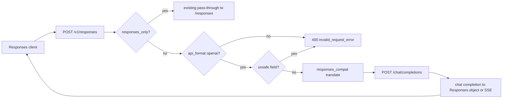

# feat: Translate Responses API to Chat Completions for OpenAI-format providers

## Goal Capsule

- Objective: Codex and any other Responses-only client can call `POST /v1/responses` against an OpenAI-format, Chat-Completions-only provider (DeepSeek and the same shape) and get a Responses-shaped answer, including the SSE sequence Codex 0.156 actually parses.
- Means: a dedicated translator in front of the existing chat-completions upstream path. Responses-native providers keep the current pass-through, including its Codex-upstream normalizations.
- Product authority: GitHub issue #35. This plan's Product Contract is the bootstrap of that issue. Do not add a provider opt-in flag; the reported reproduction has no new config key.
- Stop conditions: do not translate Anthropic-format providers. Do not change the `responses_only` pass-through. Do not invent server-side conversation state.
- Execution profile: test-first for the translator, then wire the route. Prove with `pytest` on the new unit tests and the existing Responses route tests.
- Tail ownership: the implementing agent owns tests, the route change, and updating the test that currently expects a 400 for every non-`responses_only` provider.

## Product Contract

Product Contract preservation: created here from issue #35. No prior requirements artifact.

### Summary

`POST /v1/responses` today is a pass-through that refuses every provider that does not declare a Responses-only upstream. Current Codex releases only speak Responses (`wire_api = "responses"`) and reject `wire_api = "chat"`, so Chat-Completions-only providers such as DeepSeek cannot be used through the gateway even though `/v1/chat/completions` already works.

### Problem Frame

The refusal is in `src/otel_agent/server.py` (`Provider '{name}' does not serve the Responses API`). It is correct for a route that has no translator. It is the wrong answer once the client cannot speak chat completions. The gateway already owns protocol conversion between OpenAI and Anthropic; this is the same job for Responses to Chat Completions.

### Requirements

- R1. `POST /v1/responses` to an OpenAI-format provider that is not Responses-only is translated to that provider's `/chat/completions` endpoint, not refused and not forwarded to `/responses`.
- R2. A non-streaming client receives one Responses response object. A streaming client receives Responses SSE, not Chat Completions chunks and not a synthesized `data: [DONE]`.
- R3. Responses-only providers keep the existing pass-through, including forced `stream`, `store: false`, `include`, and the stripped parameters. Those normalizations must not apply to the translation path.
- R4. Model rewriting, bearer resolution, telemetry, and upstream error framing stay on the existing request path. Telemetry `format` for this route remains `responses`. Usage is recorded when the upstream supplies integer token counts.
- R5. Tool calls round-trip. Function tools stay function calls. Custom tools stay custom tool calls, because Codex executes them by item type.
- R6. Features that cannot be represented without lying are a 400 `invalid_request_error` that names the field, before any upstream call. Features Codex always sends and that do not carry conversation state are dropped, not errored (see Assumptions).
- R7. Anthropic-format providers stay refused on this route, with a message that names the format limitation rather than suggesting a Responses surface they do not have.

### Actors

- A1. Codex CLI (and any Responses client) posting to the gateway.
- A2. An operator with an OpenAI-format provider such as DeepSeek.
- A3. An operator with a Responses-only provider (Codex subscription). Behavior must not change.

### Key Flows

- F1. Codex `exec` against `provider/model` on an OpenAI-format provider. Gateway converts the Responses body, calls chat completions, and streams Responses events until `response.completed`.
- F2. Same route, `stream` omitted or false. Gateway calls chat completions once and returns one Responses object.
- F3. Same route, Responses-only provider. Existing pass-through, unchanged.
- F4. Client sends `previous_response_id`, `store: true`, a hosted tool, or an input item the translator cannot carry. Gateway returns 400 and does not call upstream.

### Acceptance Examples

- AE1. The issue reproduction payload (`model: deepseek/deepseek-v4-pro`, OpenAI-format DeepSeek provider) is no longer the "does not serve the Responses API" 400. The upstream URL is `{base}/chat/completions`.
- AE2. A chat completion `{choices: [{message: {content: "OK"}}], usage: {prompt_tokens, completion_tokens, total_tokens}}` becomes a Responses object whose output message text is `OK`, whose `id` is a non-empty string, and whose `usage` uses `input_tokens` / `output_tokens` / `total_tokens`.
- AE3. A streaming chat completion that emits two content deltas and a final usage chunk becomes SSE frames Codex parses: `response.output_text.delta` for each delta, `response.output_item.done` whose item is a message with `output_text`, and `response.completed` whose `response.id` is a string. No `data: [DONE]`.
- AE4. A chat completion `tool_calls` entry whose name was declared as a function tool becomes a `function_call` item with `arguments` as a string and a `call_id`. A name declared as `type: custom` becomes a `custom_tool_call` with `input` as a string.
- AE5. `previous_response_id`, `store: true`, `tools` entries of type `web_search` / `tool_search` / `namespace`, and input items of type `web_search_call`, `local_shell_call`, `agent_message`, `mcp_call`, or `image_generation_call` return 400 and the HTTP client is not called.
- AE6. A Responses-only provider request still hits `{base}/responses` with the existing normalizations, and still rejects `previous_response_id` as stateless.
- AE7. An Anthropic-format provider on `/v1/responses` returns 400 and is not forwarded.

### Success Criteria

- The issue's 400 no longer happens for OpenAI-format providers.
- Existing Responses-only route tests still pass.
- New translator tests cover AE2–AE5 and AE7.

### Scope Boundaries

- In scope: request translation, response translation, streaming translation, route selection, telemetry of the client-visible Responses shape, tests.
- Out of scope: a `responses_compat` config flag; translating Anthropic; storing `previous_response_id`; executing hosted tools (`web_search`, `tool_search`, computer use, MCP); emitting reasoning summaries or `reasoning.encrypted_content`; changing dashboard rendering; changing the Codex subscription pass-through.

### Dependencies

- Codex 0.156 HTTP client (`codex-rs/codex-api` and `codex-rs/core/src/client.rs`, read 2026-09-23) always sends `stream: true`, `store: false`, `tool_choice: "auto"`, `include: ["reasoning.encrypted_content"]`, and the full `input` array. `previous_response_id` is websocket-only. `supports_websockets = false` in the issue's client config, so the HTTP shape is the one this route must satisfy.
- Codex consumes text from `response.output_text.delta`, items from `response.output_item.done`, and completion from `response.completed`. `response.function_call_arguments.delta` is ignored. A stream that ends without `response.completed` is an error (`stream closed before response.completed`). `response.failed` is how a mid-stream failure becomes an `ApiError`.
- `response.completed.response` must include `id: string`. If `usage` is present it must include `input_tokens`, `output_tokens`, and `total_tokens` as integers. A partial usage object fails Codex's deserializer. Omit `usage` rather than send a partial one.
- `normalize_usage` in `src/otel_agent/server.py` already reads `prompt_tokens` / `completion_tokens` as well as `input_tokens` / `output_tokens`.

### Outstanding Questions

- None blocking. Deferred: whether namespace tools should be flattened later. This plan errors on them.

### Sources

- GitHub issue #35, `xiaoquisme/otel-agent`.
- `src/otel_agent/server.py` Responses route and `_handle_responses_non_streaming`.
- `src/otel_agent/provider_utils.py` `build_upstream_url` vs `build_responses_upstream_url`.
- Codex SSE parser `codex-rs/codex-api/src/sse/responses.rs` and request struct `ResponsesApiRequest`.

## Planning Contract

### Key Technical Decisions

- KTD1. Automatic translation, no new config key. The issue's reproduction fails before any provider setting can be read as opt-in, and the proposed `responses_compat` flag is explicitly optional. Adding it would leave the reported config broken. Governs R1.
- KTD2. Translation lives in a new module, `src/otel_agent/responses_compat.py`, not inside the Responses pass-through and not inside `converter.py`'s OpenAI/Anthropic pair. The pass-through's normalizations (`store`, `include`, popped `temperature`) are accommodations of one upstream and must not leak onto DeepSeek. Governs R3.
- KTD3. Route selection: `serves_only_responses` keeps the current handler. `api_format == "openai"` uses the translator and `build_upstream_url`. Anything else (today: anthropic) is a 400 that names the format. Governs R1, R3, R7.
- KTD4. Fail closed on state and on hosted tools. Drop only the Codex-always-sent fields listed in Assumptions, because erroring on them makes every Codex request fail before the model is asked. Governs R6.
- KTD5. Streaming is its own converter fed by chat-completions SSE, then framed as `event: <type>\ndata: <json>\n\n`. Do not reuse `_handle_streaming`'s same-format pass-through: that path emits bare `data:` frames and a `[DONE]` marker, which Codex cannot treat as a completed response. Upstream HTTP errors and connect/timeout failures on the streaming path are `event: response.failed`, then the stream ends. Do not also emit `response.completed`. Governs R2.
- KTD6. Custom tools are remembered by name. A chat `tool_call` whose name was `type: custom` is emitted as `custom_tool_call` with `input` equal to the arguments string. A function tool is emitted as `function_call` with `arguments` as a string and `call_id`. Codex dispatches on item type, not on the chat-completions shape. Governs R5.
- KTD7. Non-streaming translation builds the Responses object itself. It does not pretend the upstream sent `response.completed`. The streaming converter's terminal `response.completed.response` is that same object shape, so both clients see one dialect. Governs R2, AE2, AE3.
- KTD8. Telemetry logs the client-visible Responses body (the object, or the streamed events' terminal response plus usage), with `source_format="responses"`. Model prefixing stays in `_log_telemetry`. Do not log the chat-completions body as if the client spoke chat. Governs R4.

### High-Level Design

Request mapping, directional:

- `instructions` becomes a leading system message when non-empty.
- `input` string becomes one user message. `input` array items of type `message` become chat messages. Content parts `input_text` and `output_text` become text. `input_image` with `image_url` becomes an image_url part. `file_id` images and `input_audio` are refused.
- `function_call` plus `function_call_output` become an assistant `tool_calls` message and a `role: tool` message. `custom_tool_call` plus `custom_tool_call_output` do the same, and the name is recorded as custom.
- Reasoning items in `input` are dropped. They are not conversation turns the chat API can replay, and refusing them breaks Codex multi-turn because Codex resends them.
- Function tools map to chat `tools` of type `function`, using the Responses function schema (`name`, `description`, `parameters`). Custom tools map to a function whose single string parameter is `input`.
- `max_output_tokens` maps to `max_tokens`. `temperature` and `top_p` pass through when present. `parallel_tool_calls` passes through. `tool_choice` of `auto`, `none`, `required`, or `{type: function, name}` maps to the chat form. Other tool_choice shapes are refused.
- `text.format` of type `json_schema` maps to chat `response_format`. Other `text.format` types are refused. `text.verbosity` is dropped.
- Upstream `model` is the rewritten bare model id, same as the chat route.

Response mapping, directional:

- One assistant message with text becomes one output item `{type: message, role: assistant, content: [{type: output_text, text}]}`.
- Each tool call becomes one output item, function or custom as remembered. Arguments stay a string. `call_id` is the chat `id`, or a generated id when the upstream omits it.
- `finish_reason` of `length` sets `status: incomplete` and `incomplete_details.reason: max_output_tokens`. Otherwise `status: completed`.
- `id` is `resp_` plus a random suffix when the upstream id is missing or not a string. Codex requires `id`.
- Usage is included only when all three integer counts are known.

Streaming event order for a text answer: `response.created`, `response.output_item.added`, `response.content_part.added`, one `response.output_text.delta` per content delta, `response.output_text.done`, `response.content_part.done`, `response.output_item.done`, `response.completed`. Tool-call deltas accumulate and are emitted as one `response.output_item.done` per completed call, not as argument-delta events. `sequence_number` may be included; Codex ignores unknown fields.

### Assumptions

- A1. No `responses_compat` setting. Automatic for every OpenAI-format provider that is not `responses_only`.
- A2. These request fields are dropped, not errored, because Codex 0.156 always sends them and they do not carry conversation state: `reasoning`, `include`, `stream_options`, `service_tier`, `prompt_cache_key`, `client_metadata`, `access_programs`, `text.verbosity`, and `store` when it is false or absent. `store: true` is a 400.
- A3. Reasoning items inside `input` are dropped. Visible messages and tool results are kept.
- A4. Hosted tool types and namespace tools are refused rather than flattened. Flattening is deferred.
- A5. The existing test `test_responses_route_declines_providers_without_a_responses_surface` changes meaning: an OpenAI-format provider is no longer declined. Anthropic refusal is a new assertion, not a silent rewrite of the Codex pass-through tests.

### Sequencing

U1 then U2 then U3. U3 depends on U1's request translator and U2's response object. Route wiring is inside U2 and U3, not a fourth unit, so the pass-through stays untouched until the translator exists.

## Implementation Units

### U1. Responses request translator

Goal: turn a Responses body into a chat-completions body, or a named 400, with no I/O.

Requirements: R1, R5, R6

Files: `src/otel_agent/responses_compat.py`, `tests/test_responses_compat.py`

Approach: pure functions. `UnsupportedResponsesFeature` carries the field name and a client-facing message. `responses_to_chat_request(body, upstream_model) -> dict` performs the mapping in KTD4 and the request half of the High-Level Design. Do not call the network. Do not import FastAPI.

Test scenarios:

- Instructions plus a string `input` become a system message and a user message. Model is the supplied upstream id.
- A message item with `input_text` and an assistant message with `output_text` keep order and roles.
- A function tool and a following `function_call` / `function_call_output` pair become chat tools, an assistant tool call, and a tool message. `call_id` is preserved.
- A custom tool is recorded and becomes a function tool with a string `input` parameter.
- `max_output_tokens` becomes `max_tokens`. `temperature` passes through.
- `previous_response_id`, `store: true`, `web_search` tool, `namespace` tool, `input_audio`, and `local_shell_call` each raise `UnsupportedResponsesFeature` and name the field.
- `reasoning`, `include`, and `store: false` are absent from the chat body and do not raise.
- A reasoning item in `input` is omitted; surrounding messages remain.

Verification: `pytest tests/test_responses_compat.py -q` green for the request cases.

### U2. Non-streaming response object and route selection

Goal: a chat completion becomes a Responses object, and `/v1/responses` uses it for OpenAI-format providers without touching the pass-through.

Requirements: R1, R2, R3, R4, R7, AE1, AE2, AE6, AE7

Files: `src/otel_agent/responses_compat.py`, `src/otel_agent/server.py`, `tests/test_responses_compat.py`, `tests/test_server.py`

Approach: `chat_completion_to_response(chat, *, model, custom_tool_names) -> dict` builds the object in the response half of the High-Level Design. The route, after the existing model/provider resolution, branches on KTD3. The OpenAI branch rejects unsafe features by catching `UnsupportedResponsesFeature` as 400 before building headers. It then calls the existing non-streaming handler only if that handler can convert the body. It cannot today (`source_format != target_format` only knows anthropic). So the OpenAI non-streaming branch posts through the existing client path by calling `_handle_non_streaming` with a new conversion hook, or by a small sibling that posts, converts, and logs with `source_format="responses"`. Prefer a sibling over growing the anthropic branch: the sibling reuses connect/timeout/status handling by calling the same telemetry function, and does not force `stream: true`. Update `test_responses_route_declines_providers_without_a_responses_surface` so the OpenAI provider is forwarded to `/chat/completions`. Add an Anthropic provider case that still 400s and does not call upstream.

Test scenarios:

- Chat completion text `OK` plus full usage becomes AE2.
- Missing usage omits `usage` rather than sending null counts.
- `finish_reason: length` sets incomplete.
- A function tool call and a custom tool call become the two item types in AE4.
- Route: OpenAI-format provider, non-streaming Responses body, mock `httpx.AsyncClient.post` sees `{base}/chat/completions` and the translated messages. Client receives the Responses object. Telemetry row format is `responses` and token counts match.
- Route: Responses-only provider still uses `httpx.AsyncClient.stream` against `/responses` and still rejects `previous_response_id` without calling upstream.
- Route: Anthropic provider returns 400 and the HTTP client is not called.
- Route: `previous_response_id` on an OpenAI-format provider returns 400 and the HTTP client is not called.

Verification: `pytest tests/test_responses_compat.py tests/test_server.py -q` green.

### U3. Streaming Responses SSE

Goal: chat-completions SSE becomes the event sequence Codex parses, including tool calls and upstream failures.

Requirements: R2, R4, R5, AE3, AE4

Files: `src/otel_agent/responses_compat.py`, `src/otel_agent/server.py`, `tests/test_responses_compat.py`, `tests/test_server.py`

Approach: `ChatToResponsesStreamConverter` consumes chat chunks and yields SSE frame strings. The route's streaming branch uses `httpx` stream against `build_upstream_url`, requests `stream: true` and `stream_options.include_usage: true` on the chat body, and yields the converter's frames. It does not emit `[DONE]`. On upstream status >= 400 with a non-SSE body, yield `response.failed` whose `response.error.message` is the upstream message, then stop. Connect and timeout do the same, and telemetry still logs. Terminal `response.completed` uses U2's object, with usage taken from the chat chunk when all three integers exist. Tool-call argument fragments are concatenated per index and emitted once as `output_item.done`.

Test scenarios:

- Two content deltas and a usage chunk produce AE3's event types in order, each frame has an `event:` line and a `data:` line whose JSON `type` matches, and `response.completed.response.id` is a string. No `[DONE]`.
- A split tool-call argument across chunks becomes one `function_call` item with the concatenated arguments string.
- A custom tool name becomes `custom_tool_call`.
- An upstream 400 JSON body becomes one `response.failed` frame and no `response.completed`.
- Route-level: streaming Responses request to an OpenAI-format provider uses `client.stream` against `/chat/completions`, and the client body contains `response.output_text.delta` and `response.completed`. Telemetry records usage from the final chunk.
- Responses-only streaming test `test_responses_route_does_not_synthesize_done` still passes.

Verification: `pytest tests/test_responses_compat.py tests/test_server.py -q` green.

## Verification Contract

- Unit and route proof: `pytest tests/test_responses_compat.py tests/test_server.py -q` from the repo root, using the project environment (`uv run pytest` if the shell has no project pytest).
- Regression: the existing Responses-only tests in `tests/test_server.py` stay green, especially previous-response rejection, event-line preservation, and no synthesized `[DONE]`.
- No UI, no release packaging, no dashboard rebuild. Do not install the CLI tool as part of this change.

## Definition of Done

- U1, U2, and U3 test scenarios pass.
- `POST /v1/responses` for an OpenAI-format provider no longer returns the issue's "does not serve the Responses API" error.
- Responses-only pass-through behavior is unchanged.
- Anthropic providers are still refused on this route.
- Unsafe fields are refused before upstream I/O.
- No new provider config key.

## Appendix

Local research, 2026-09-23:

- `docs/solutions/` has no Responses-to-chat translator. The closest lesson is `docs/solutions/runtime-errors/streaming-format-detection-priority.md`: telemetry `format` is the client dialect, not "was this streamed". This plan logs `responses` for that reason.
- `docs/solutions/architecture-patterns/import-supergrok-oauth-sidecar-vault.md` records that xAI did not need a Responses adapter. That decision does not apply here: Codex cannot fall back to chat, and DeepSeek has no Responses surface.
- Repo pattern to follow: protocol conversion is pure functions plus a thin route (`src/otel_agent/converter.py`), upstream URL construction stays in `src/otel_agent/provider_utils.py`, and Responses-only behavior is a declaration (`AuthSource.responses_only`) rather than a provider-name branch.
