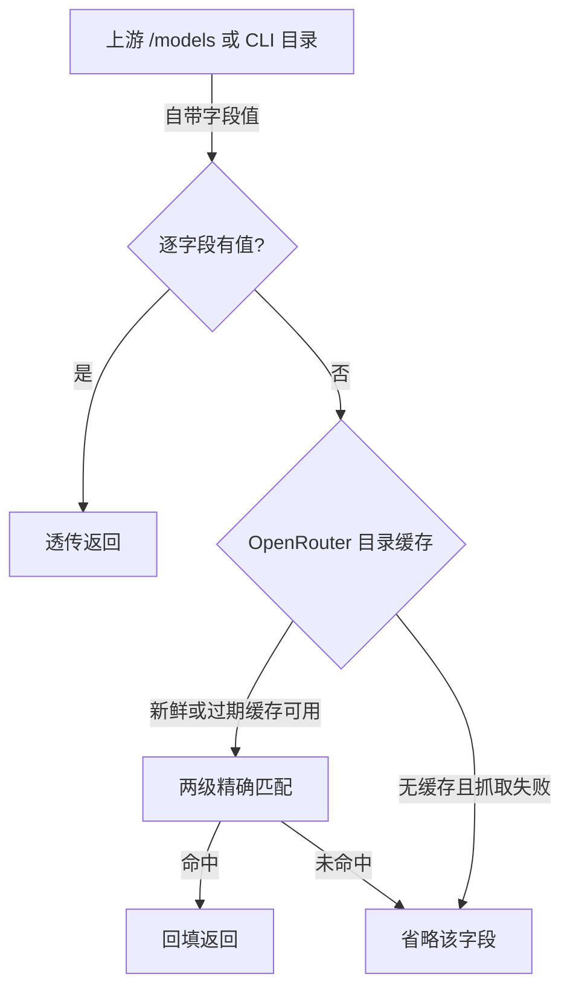
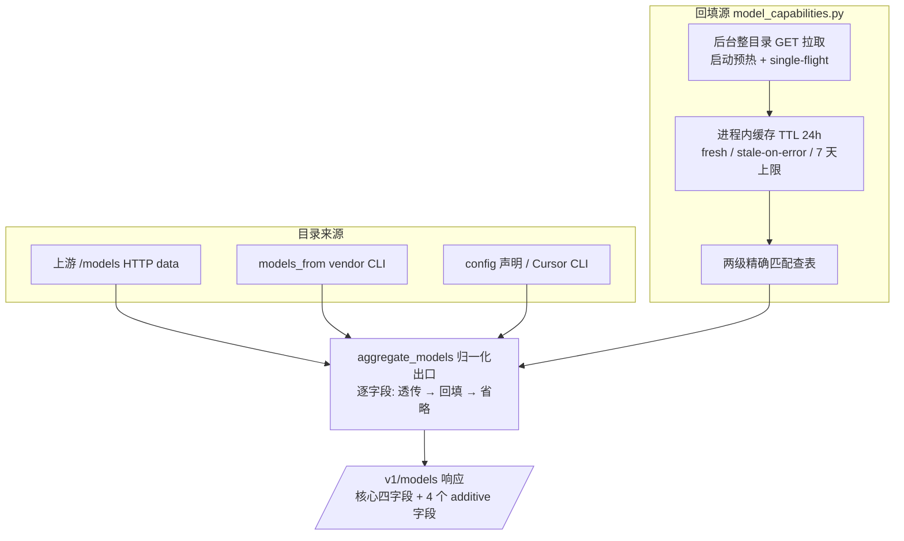

# Model Capability Metadata - Plan

## Goal Capsule

- **Objective:** 让 `/v1/models` 对外提供模型的能力元数据——上下文长度、输出上限、输入/输出模态（`context_length`、`max_output_tokens`、`input_modalities`、`output_modalities`）——零配置、不新开接口、缺省即省略。
- **Product authority:** 本次会话的用户决策——在原 `/v1/models` 结构上加字段而非新接口；上游缺省时查 OpenRouter 公共目录回填（带缓存）；不引入 config 配置入口；字段名用 `input_modalities`/`output_modalities`；抓取失败但有过期缓存时用过期值回填。
- **Stop conditions:** 全量 `uv run pytest` 绿；契约文档与实现口径一致；出现改变产品行为的分歧时停下来找用户，而不是猜。
- **Execution profile:** 顺序实现 U1 → U2 → U3，每单元原子提交。
- **Tail ownership:** 实现者负责清理废弃尝试代码；文档随 U3 一并落。

## Product Contract

### Summary

给 `GET /v1/models` 的每个模型条目追加 4 个 additive 字段：`context_length`、`max_output_tokens` 两个数值，`input_modalities`、`output_modalities` 两个字符串数组。元数据来源链为：上游/CLI 目录透传 → 缺省时按模型 id 查 OpenRouter 公共目录回填（整目录缓存，stale-on-error）→ 仍无则整体省略字段。

### Problem Frame

`GET /v1/models` 今天只返回 `{id, object, created, owned_by}`，上游 `/models` 自带的额外元数据在归一化出口被丢弃，CLI 与声明目录路径只交换纯 id 字符串——客户端没有任何渠道获知模型的上下文长度、输出上限与输入/输出模态。需求已经以野生形态出现：客户端用 `[500k]`/`[1m]` 后缀向 router 表达上下文诉求，而后缀被剥除，信息双向缺失。009 契约当年一并否决的是带更多元数据的自定义格式（理由：SDK 兼容）；2026-09 基于 `errors` 与 OpenRouter 两个先例修订该取舍、接受 additive 字段——这是有意修订，不是对旧裁决的重新解读。

### Key Decisions

- **在 `/v1/models` 响应上加 additive 字段，不新开接口。** 归一化出口是唯一收窄点，挂载成本最低；OpenRouter 把扩展字段放进 model 对象已是事实标准，OpenAI SDK 对未知字段宽容；仓库已有 body 级 additive 先例（`errors` 字段）。
- **来源链固定为「上游透传 → OpenRouter 回填 → 整体省略」，零配置。** 不引入任何 config 声明入口（用户明确砍掉）；把「数据从哪来」从维护问题变成查询问题，长尾靠省略纪律兜底而非人工声明。注意 id 归一化的别名表是一份随第三方命名习惯演进的**维护面**——未命中的 id 记内部日志（见 R7），让覆盖衰减可见，别让「查询问题」掩盖它。
- **宁缺勿错：归一化后精确匹配，匹配不上即省略。** 假元数据比没有元数据更糟；不填 0、不猜值、不做模糊匹配。
- **OpenRouter 目录整目录一次拉取并缓存（TTL 24 小时级，stale-on-error）。** 每 TTL 窗口一次 HTTP、每模型本地查找；抓取失败但存在过期缓存时继续用过期值回填，无缓存才省略（用户拍板）。
- **字段集为两个数值 + 两个模态数组，命名 `context_length`/`max_output_tokens`/`input_modalities`/`output_modalities`。** 模态命名沿用 OpenRouter 与 OpenAI Realtime API 的既有词汇（用户拍板）；响应不带 source 溯源标签。
- **009 契约按「核心四字段名称与语义不变、允许附加字段」解释并同步更新契约文档。** 已与用户确认。

### Requirements

**响应契约**

- R1. `GET /v1/models` 的每个模型条目在既有 `{id, object, created, owned_by}` 之外附加 4 个可选字段：`context_length`、`max_output_tokens`、`input_modalities`、`output_modalities`；核心四字段的名称与语义不变。
- R2. 元数据不可得时该条目整体省略对应字段——不填 0、不返回 null、不猜测。
- R3. `context_length` 为上下文窗口总长度（整数），`max_output_tokens` 为单次响应最大输出 token 数（整数），`input_modalities`/`output_modalities` 为字符串数组（输入取值 `text`/`image`/`file`/`video`/`audio`，输出取值 `text`/`image`/`audio`，未见过的新取值原样透传）。
- R4. 响应不携带来源溯源标签，保持最小字段集；来源信息只在内部保留。

**元数据来源**

- R5. 取值顺序逐字段生效：上游/CLI 目录自带的值透传 → OpenRouter 公共目录回填 → 省略。透传限定「同名 + 类型正确」（两个整数、两个字符串数组）才生效；不做 `max_tokens`/`context_window` 等近义键映射，其余一律落入回填链。
- R6. OpenRouter 回填以整目录一次拉取实现并缓存（TTL 24 小时级）；单请求内的逐模型查找是本地操作，不发起逐模型 HTTP。
- R7. 模型 id 匹配先做归一化（小写化、vendor 别名如 `xai`↔`x-ai`、版本分隔符如 `v-2.5`↔`v2.5`）再精确匹配；变体后缀（`:batch`、`:free` 等）保持 id 原样参与匹配、不剥除。查找两级精确：先原始 id，再完整条目 id（`{provider}/{raw_id}`）；归一化键冲突（多个条目归一到同一键）时该键整体省略。不做模糊匹配；未命中的 id 记内部日志（不新增接口、字段或配置）。
- R8. OpenRouter 不可达、超时或响应异常时：存在过期缓存则用过期缓存回填（stale-on-error），无缓存可用则省略字段；`/v1/models` 的可用性与延迟不受影响，永不因此报错。过期缓存的陈旧度有上限：`fetched_at` 距今超过 7 天的表按无缓存处理。

**兼容与治理**

- R9. 不引入任何 config 元数据声明入口。
- R10. 元数据只在 `/v1/models` 归一化出口产生一次；OpenAI SDK `client.models.list()` 兼容性保持（specs/009 SC-003），`specs/009-models-api` 的契约文档与既有契约测试随本次变更同步更新。

### Key Flows

- F1. **元数据回填链**（R5–R8）
  - **Trigger:** `GET /v1/models` 被调用，归一化出口为每个条目装配元数据。
  - **Steps:** 逐字段看上游/CLI 自带值 → 缺省则查本地缓存的 OpenRouter 目录（两级精确匹配）→ 命中则回填 → 未命中或目录不可用且无缓存则省略字段；目录不可用但有过期缓存（且未超 7 天）则用过期缓存。
  - **Outcome:** 每个条目的 4 个字段要么带完整值，要么缺该字段；响应永不因回填失败而报错。

### Acceptance Examples

- AE1. **上游自带元数据（Covers R1, R5）**
  - **Given:** 上游 `/models` 返回的条目带 `context_length: 200000`（同名且整数）；
  - **When:** 客户端请求 `GET /v1/models`；
  - **Then:** 该条目返回 `context_length: 200000`，不被丢弃、不被 OpenRouter 值覆盖。
- AE2. **回填命中（Covers R1, R6, R7）**
  - **Given:** CLI 目录 provider 名为 `xiaomi`、原始 id `mimo-v-2.5`（装配后条目 id `xiaomi/mimo-v-2.5`），本地缓存的 OpenRouter 目录中存在归一化后命中的条目；
  - **When:** 聚合出口装配该条目；
  - **Then:** 返回该条目的 `context_length`、`max_output_tokens`、`input_modalities`、`output_modalities`，期间无逐模型 HTTP 请求。
- AE3. **匹配不上即省略（Covers R2, R7）**
  - **Given:** 模型 id 归一化后在 OpenRouter 目录中无精确命中（如 cursor sidecar 模型）；
  - **When:** 聚合出口装配该条目；
  - **Then:** 返回的条目仅含核心四字段，不返回相近模型的值。
- AE4. **目录不可用（Covers R8）**
  - **Given:** OpenRouter 请求超时或返回错误；
  - **When:** 客户端请求 `GET /v1/models`；
  - **Then:** 存在过期缓存则用过期缓存回填（7 天内）；无缓存或缓存超龄则省略字段；两种情况下响应均正常返回，无错误信息、无请求失败。
- AE5. **模态字段（Covers R1, R3）**
  - **Given:** OpenRouter 目录中 `xiaomi/mimo-v2.6-pro` 的输入模态为 text/image/video/audio、输出模态为 text；
  - **When:** 聚合出口装配该条目且上游未自带模态；
  - **Then:** 返回 `input_modalities: ["text","image","video","audio"]`、`output_modalities: ["text"]`。

### Scope Boundaries

- 不做 `[500k]`/`[1m]` 后缀从被剥除到被校验的协商闭环（ideation 方向 4）——字段落地后是自然的下一步。
- 不做观测违规检测与 `finish_reason` 落库（ideation 方向 5）。
- 不新增 `/v1/models/{id}` 详情端点或任何元数据专用接口。
- 不扩展 dashboard、配额、告警等消费面；内部治理只做到「单一产生点」。
- 不动同名不同物的请求侧 `max_output_tokens` 处理（`src/otel_agent/server.py`、`src/otel_agent/responses_compat.py`）与 dashboard 用量视图。
- 不做 `max_tokens`/`context_window` 等上游近义键映射（R5 白名单之外的键一律走回填链）。

### Dependencies / Assumptions

- 依赖 OpenRouter 公共目录（`/api/v1/models`，匿名可达；2026-09-28 实测 458 个模型：`context_length` 与两个模态字段全覆盖，`top_provider.max_completion_tokens` 有 7 条为 null（如 `typesafe/jev-router`）——这些条目缺 `max_output_tokens`、其余照常，正是 R2 省略路径的活例；响应带 `max-age=120, stale-if-error=3600` CDN 头、未暴露速率限制头）。失败路径仅是字段省略或过期值。
- 假设 OpenRouter 的数值是名义模型值，与特定部署档位可能不一致（实测 39/458 条目的 `context_length` 与 `top_provider.context_length` 不同，前者名义、后者实际；`context_length` 统一取名义的顶层值）；本次接受这一误差，留待观测校验（方向 5）去抓背离。
- 上游透传白名单（R5）之外的同义键不会被映射——这是接受「部分上游能力不透传、走回填或省略」的取舍。

### Sources / Research

- `docs/ideation/2026-09-27-model-capability-metadata-ideation.html`——候选、核验与淘汰记录。
- `specs/009-models-api/spec.md`（FR-010、SC-003）、`specs/009-models-api/research.md`（Decision 3）、`specs/009-models-api/contracts/models-api.md`——既有契约约束。
- `src/otel_agent/models.py`——归一化出口（元数据丢弃点）、`ModelCache` 缓存模式、`errors` additive 先例；`src/otel_agent/router.py`——`[500k]`/`[1m]` 后缀剥除。
- OpenRouter `/api/v1/models`——回填数据源（`context_length`、`top_provider.max_completion_tokens`、`architecture.input_modalities`/`output_modalities`）。

---

## Planning Contract

### Key Technical Decisions

- **KTD1. 回填源独立为 `src/otel_agent/model_capabilities.py`，复用 `ModelCache` 模式。** 整目录进程内缓存 + `fetched_at` 时间戳，TTL 24 小时。`lookup()` 是同步、纯本地操作，**永不发起网络请求**；网络只发生在后台刷新里：进程启动即发起一次后台目录拉取（冷启动预热）；TTL 过期的请求先用旧表响应并触发后台刷新（stale-while-revalidate）；无缓存的请求返回空能力并触发后台刷新，绝不阻塞。刷新 single-flight（同一时刻至多一个在途拉取）+ 失败冷却（一次失败后 5 分钟内不再重试）。刷新失败时继续用过期缓存（stale-on-error），但 `fetched_at` 距今超过 7 天的表按 absent 处理。缓存状态四种：fresh / stale 可用 / absent 从未拉取 / failed 已尝试但失败——后两者查询都返回空能力。不落盘——目录只有几百 KB，进程内重建成本低，落盘是 YAGNI。抓取钉死 `https://openrouter.ai/api/v1/models`、不跨域跟随重定向。
- **KTD2. 匹配 = 归一化后精确匹配，变体后缀不剥除。** 归一化集合：小写化、vendor 别名表（`xai`↔`x-ai`）、版本分隔符归一（`v-2.5`↔`v2.5`）；`:batch`/`:free` 等变体后缀保持 id 原样参与匹配——OpenRouter 把 `model` 与 `model:batch` 列为独立条目（实测 72 对、其中 6 对 `max_completion_tokens` 不同），剥除后缀会把两个条目挤到一个键上串号。查找两级精确：先原始 id，再完整条目 id（`{provider}/{raw_id}`）；查表命中即用，绝不模糊匹配。多个条目归一到同一键时该键整体省略（宁缺勿错），并有测试场景覆盖。别名表是随第三方命名习惯演进的维护面；查询未命中时记内部日志。
- **KTD3. 字段唯一产生点是 `aggregate_models` 归一化出口，逐字段透传优先。** 上游 HTTP 路径（`fetch_provider_models` 原样返回的 data）自带的值按 R5 白名单（同名 + 类型正确）透传；CLI/声明/Cursor 三条纯 id 路径天然走回填。消费面只读。
- **KTD4. 字段形状：两个整数 + 两个字符串数组，不带 source 标签。** `max_output_tokens` 取目录 `top_provider.max_completion_tokens`（`top_provider` 才是实际值）；`context_length` 取名义的顶层值（与 `top_provider.context_length` 的偏差见 Assumptions）；模态取 `architecture.input_modalities`/`output_modalities`，枚举不校验、原样透传。摄入时做类型校验：两个整数须为正整数且在合理上限内、模态须为字符串数组、目录响应有大小上限——不合格条目/字段按宁缺勿错丢弃（防第三方目录被篡改时坏值进响应）。
- **KTD5. 009 契约口径：核心四字段不动、允许附加字段。** 同步更新契约文档，并在 `research.md` Decision 3 补一行沿革注记——按「2026-09 修订当年取舍」的口径撰写（当年否决的是带 more metadata 的 custom format，理由是 SDK 兼容；如今以 `errors`/OpenRouter 先例为据接受 additive 字段），不写成「当年被误读」。

### High-Level Technical Design

元数据只在出口产生一次，消费面只读；`lookup()` 永不等网络（KTD1）。

### Assumptions

- OpenRouter 目录保持匿名可达、字段名稳定（`context_length`、`top_provider.max_completion_tokens`、`architecture.input_modalities`/`output_modalities`）；字段缺失条目按省略处理，不视为错误。
- 模态新取值（未来新增枚举）按字符串透传，不做白名单校验。
- vendor 别名表随第三方命名习惯演进，是代码内维护面；未命中 id 的内部日志是发现新命名变体的渠道。
- 缓存按进程成立（specs/009 Decision 2：网关 single-process）；部署形态若变多进程需重估「每 TTL 一次 HTTP」口径。

### Implementation Constraints

- 无新运行时依赖：`httpx` 已在 `pyproject.toml`。（SC-003 的 SDK 兼容证据以具名断言承担——`tests/test_server.py` 的 `/v1/models` 端点断言 + U2 的核心四字段不变断言；不为此引入 `openai` 依赖。）
- 不动 `src/otel_agent/router.py` 的后缀剥除、不动请求侧 `max_output_tokens` 处理、不动 dashboard。
- 配置坏值降级、`errors` additive 先例等既有纪律保持。

### Risks & Dependencies

- **OpenRouter schema 漂移**（字段改名/条目缺失）→ 逐字段省略纪律兜底，响应形状不随第三方字段抖动；`top_provider.max_completion_tokens` 缺失的条目只少一个字段。
- **目录被篡改/投毒**（第三方数据进公开响应）→ KTD4 摄入类型校验 + HTTPS 钉死不跨域重定向 + 逐字段省略兜底；模态字符串不做过滤，渲染/转义责任在消费方（已接受）。
- **刷新风暴**（OpenRouter 长期不可用时每请求一次出站重试）→ KTD1 single-flight + 失败冷却，stale-on-error 服务期间出站探测有固定上界。
- **刷新延迟传导** → KTD1 的 stale-while-revalidate 保证 `/v1/models` 不等网络；这是 R8「延迟不受影响」主张的实现支撑。
- **同名不同物**：响应字段 `max_output_tokens` 与请求侧参数同名（`server.py`、`responses_compat.py`）→ Scope Boundary 明确不动请求侧，U3 在 README 注明差异。
- **名义值与部署档位偏差**（OpenRouter 数字 ≠ 订阅档位实际）→ 已接受的产品取舍，方向 5 观测校验负责抓背离。
- **外部消费面兼容**：附加字段对 OpenAI SDK 与 curl 消费者非破坏（`errors` 先例与 OpenRouter 先例双验证）；核心四字段不动是兼容底线（SC-003）。
- **id 归一化覆盖衰减**（vendor 改名/新变体 → 静默省略）→ 别名表维护面 + 未命中日志（R7），宁缺勿错保证衰减只表现为字段缺失、不产生错值。

### Sequencing

U1（回填源）→ U2（条目装配）→ U3（契约/文档对齐），逐单元原子提交。

---

## Implementation Units

### U1. OpenRouter 目录回填源

- **Goal:** 提供「模型 id → 能力元数据」查询：整目录缓存、两级精确匹配、stale-on-error；`lookup()` 永不等网络。
- **Requirements:** R5, R6, R7, R8, F1
- **Dependencies:** 无
- **Files:** `src/otel_agent/model_capabilities.py`（新建）, `tests/test_model_capabilities.py`（新建）
- **Approach:** 目录客户端一次 `GET https://openrouter.ai/api/v1/models` 拉整目录（`httpx`，不跨域跟随重定向）；进程内 dict 缓存记录 `fetched_at` 与解析后的「归一化 id → 能力」表。`lookup(model_id)` 同步、纯本地：TTL 24h 内直接查表；TTL 过期的请求先用旧表响应并触发 single-flight 后台刷新；刷新失败沿用旧表（7 天内）；无表则本次返回空能力并触发后台刷新——请求路径绝不发起网络。进程启动即后台预拉取一次。失败冷却 5 分钟。每条能力含 `context_length`、`max_output_tokens`、`input_modalities`、`output_modalities`，目录条目缺哪个少哪个（缺 `top_provider.max_completion_tokens` 的 7 条活例走此路径）；摄入时做 KTD4 类型校验，不合格条目/字段丢弃。多个条目归一化到同一键时该键整体省略。对外暴露 `lookup(model_id)` 供 U2 装配。
- **Patterns to follow:** `src/otel_agent/models.py` 的 `ModelCache`（TTL + 失效的缓存形状）；配置坏值降级不抛错的既有纪律。
- **Test scenarios:**
  - **Covers AE2.** 命中回填：目录含 `xiaomi/mimo-v2.5` 时按 `xiaomi/mimo-v-2.5` 查询返回完整能力（归一化命中，两级查找：原始 id 或完整条目 id）。
  - 归一化边界：`xai/grok-4.6` ↔ `x-ai/grok-4.6` 互认；`model:batch` **不**剥除后缀、以原样 id 独立匹配；大小写不敏感。
  - 键冲突：两个条目归一化到同一键时该键整体省略（不返回任一条目的值）。
  - **Covers AE3.** 未命中：cursor sidecar 类 id 返回空，绝不返回相近模型值；未命中 id 记内部日志。
  - **Covers R6.** 缓存命中不重复 HTTP：同一测试进程内连续查询任意数量模型只触发一次目录请求（请求计数断言）；并发查询也只触发一次（single-flight 断言）。
  - TTL 过期后触发后台刷新，刷新成功更新缓存；请求本身不等待网络。
  - **Covers AE4.** 抓取失败 + 过期缓存存在（7 天内）：继续用过期表回填；抓取失败 + 无缓存：返回空；超龄缓存（>7 天）：按无缓存处理。
  - 边界：目录条目缺 `top_provider.max_completion_tokens` 时该条目无 `max_output_tokens`、其余照常；空目录、畸形 JSON、类型不合格条目（非正整数/非字符串数组）→ 丢弃或空能力，不抛错。
- **Verification:** `tests/test_model_capabilities.py` 全绿；单测内目录 HTTP 恰好一次（并发场景含 single-flight）。

### U2. /v1/models 条目装配

- **Goal:** `aggregate_models` 出口为每个条目挂 4 个 additive 字段，逐字段透传优先、缺即省略。
- **Requirements:** R1, R2, R3, R4, R5, R10, F1
- **Dependencies:** U1
- **Files:** `src/otel_agent/models.py`, `tests/test_models.py`, `tests/test_server.py`（端点区域）
- **Approach:** 归一化出口处逐字段装配：上游 data 自带值按 R5 白名单（同名 + 类型正确）优先（AE1），缺省查 U1 回填，仍无则该字段不出现；核心四字段与 `errors` 先例保持原语义。`tests/test_models.py` 的 :134-136 断言（`test_aggregate_empty`，空 `data`）不受 per-entry 字段影响、无需调整；实现时若遇条目形状锁定的断言，按「核心字段 + 允许附加字段」口径放宽，其原意（契约稳定性）由核心字段断言继续承担。
- **Patterns to follow:** `models.py` 的 `errors` additive 先例（约 :184-189）与「要么完整、要么整体省略」纪律（`docs/solutions/architecture-patterns/responses-chat-compat.md`）。
- **Test scenarios:**
  - **Covers AE1.** 上游自带 4 字段（同名 + 类型正确）：原样透传，回填值不覆盖；近义键（`max_tokens` 等）不透传、走回填。
  - **Covers AE2.** CLI 纯 id 条目：回填 4 字段（`created: 0` 行为不变）。
  - **Covers AE3.** 未命中条目：仅核心四字段。
  - **Covers AE5.** 模态数组透传：值与目录一致（顺序不敏感断言）。
  - 逐字段混合：上游只带 `context_length` 时其余字段走回填、回填也没有则省略。
  - **Covers R4.** 响应中不存在 source 类字段。
  - 回归：`errors` 错误注入场景行为不变；`created` 透传/缺省 0 测试保持绿。
  - **Covers R6, R10（端到端）.** `/v1/models` 端点（`tests/test_server.py`，仿既有样式）：整目录一次拉取、逐模型无 HTTP；响应含核心四字段 + additive 字段（命中）或仅核心四字段（未命中）。
- **Verification:** `tests/test_models.py`、`tests/test_server.py` 全绿；`uv run pytest` 全量绿；SC-003 证据具名为 `tests/test_server.py` 的 `/v1/models` 端点断言与 U2 的核心四字段不变断言（不引入 `openai` 依赖）。

### U3. 契约与文档对齐

- **Goal:** specs/009 契约、字段表、示例与 README 与 4 字段新口径一致。
- **Requirements:** R9, R10
- **Dependencies:** U2
- **Files:** `specs/009-models-api/contracts/models-api.md`, `specs/009-models-api/data-model.md`, `specs/009-models-api/spec.md`, `specs/009-models-api/research.md`, `README.md`
- **Approach:** 契约示例 JSON 增补 4 字段并给出一个「省略」示例；`data-model.md` 字段表增行（含取值域）；`spec.md` FR-010 补注记「核心四字段名称与语义不变、允许附加字段」；`research.md` Decision 3 补一行沿革注记（按 KTD5 的「修订」口径：2026-09 基于 `errors`/OpenRouter 先例修订当年对 more-metadata custom format 的否决，接受 additive 字段）；README 模型列表段补字段说明，并注明「零配置、无 config 元数据入口」（R9 的文档证据）及响应字段与请求侧同名参数 `max_output_tokens` 的差异。SC-003 兼容条款不动。
- **Test expectation:** none —— 纯文档/契约文本对齐，无行为变更；由 U1/U2 测试与全量 pytest 兜底。
- **Verification:** 示例、字段表、FR 注记三处口径互相对得上；README 的零配置注记覆盖 R9；全量 `uv run pytest` 保持绿。

---

## Verification Contract

| Gate | Command / check | Applies to |
|---|---|---|
| 回填源单测 | `uv run pytest tests/test_model_capabilities.py` | U1 |
| 装配与回归 | `uv run pytest tests/test_models.py` | U2 |
| 全量测试 | `uv run pytest` | U1–U3 |
| 端到端「一次拉取」 | `tests/test_server.py` 端点区域：整目录一次拉取、逐模型无 HTTP 断言（仿既有样式） | U1, U2 |
| 契约一致性目检 | `specs/009-models-api/contracts/models-api.md` 示例与实际响应一致 | U3 |

---

## Definition of Done

- R1–R10 各有测试或文档证据；Verification Contract 的 gate 全过。
- 无 config 元数据入口、无新运行时依赖、请求路径无新增阻塞 IO（`lookup()` 纯本地，网络只在后台刷新）。
- `tests/test_models.py` 的 :134-136 断言确认不受影响（空 `data`）；如另有条目形状锁定断言，按「核心字段 + 允许附加字段」口径放宽后由核心字段断言承担原契约稳定性意图。
- 不修改 `src/otel_agent/router.py`、请求侧 `max_output_tokens` 处理与 dashboard。
- 废弃尝试代码已清理，不留实验性分支。
